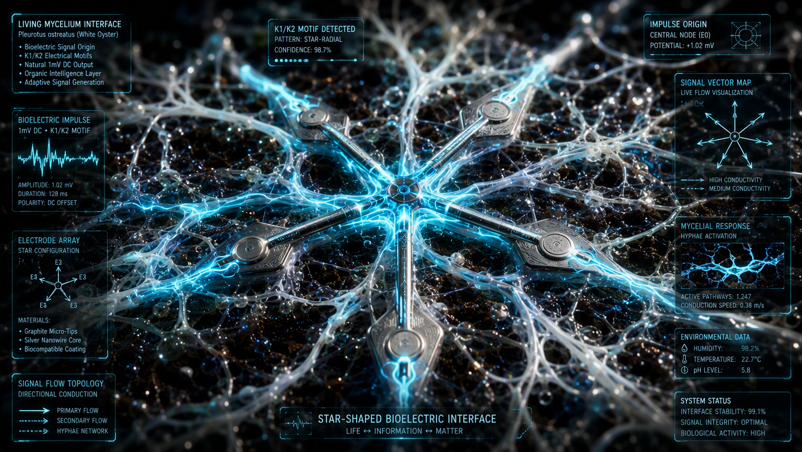
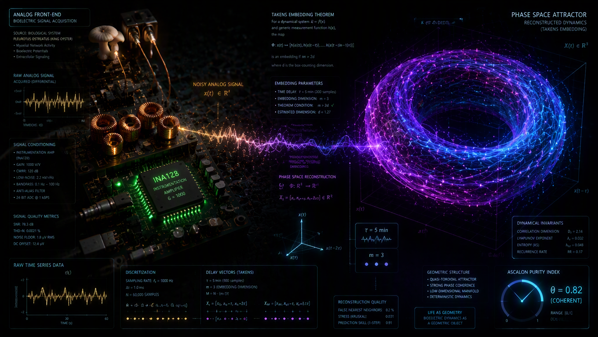

# Od Impulsu Jonowego do Atraktora Fazowego: Protokół Eksperymentalny dla Bio-Cyfrowego Mostu Fazowego (HMF v1.0) z Grzybnia Pleurotus ostreatus

## Streszczenie wykonawcze

Niniejszy raport przedstawia kompletny, samodzielnie odtwarzalny protokół eksperymentalny poziomu „garażowego”, mający na celu stworzenie i testowanie pierwszej wersji Hydrożelowego Mostu Fazowego. Głównym celem jest rejestracja ciągłych, niskoczęstotliwościowych motywów elektrycznych K1/K2 generowanych przez sieć grzybniową *Pleurotus ostreatus*, przy zachowaniu ich integralności geometrycznej i fazowej. Protokół ten jest rygorystycznie osadzony w ramach teoretycznych projektu LifeNode, co manifestuje się w kluczowych założeniach metodologicznych, takich jak ontologia „słuchania fazy” oraz metoda rekonstrukcji trajektorii symplektycznej. Podstawą dla opracowania protokołu posłużyły najnowsze publikacje naukowe z 2026 roku, które potwierdziły istnienie kierunkowości w sygnałach bioelektrycznych grzybni i wykazały skuteczność układów elektrod gwiaździstych w ich przechwytywaniu. Projekt wyraźnie wyklucza stosowanie standardowych podejść, które prowadzą do destrukcyjnej dyskretyzacji sygnału, tzw. „zabójstwa fazy”, poprzez użycie typowych przetworników analogowo-cyfrowych (ADC) w punkcie styku biologicznego z systemem cyfrowym. Zamiast tego, protokół promuje architekturę analityczną, która oddziela proces transdukcji od procesu cyfryzacji, aby zapewnić wierną reprezentację ciągłej dynamiki systemu.

Całość eksperymentu została podzielona na logiczne filary: materiały i komponenty, budowa fizyczna układu, konfiguracja elektroniki analitycznej, procedury kalibracyjne oraz plan długoterminowego monitorowania. Kluczowym elementem protokołu jest receptura hydrożelu, który nie pełni jedynie roli nośnika, ale funkcjonuje jako inteligentna membrana filtrująca, działająca jak soczewka fazowa i dolnoprzepustowy filtr, selektywnie przepuszczając wolne impulsy bioelektryczne. Weryfikacja i falsyfikowalność są fundamentalnymi elementami projektowanego eksperymentu. Protokół zawiera obowiązkowe procedury kontroli, takie jak test ślepej próby (układ bez grzybni), co pozwala na odróżnienie sygnału biologicznego od szumu środowiskowego. Dodatkowo, precyzyjne logowanie warunków mikroklimatu, w szczególności wilgotności powyżej 90%, jest niezbędne do utrzymania stabilności sygnału i minimalizacji szumu termicznego.

Analiza danych jest przeznaczona nie do interpretacji surowych wartości napięcia, lecz do odtworzenia geometrii dynamicznego atraktora w przestrzeni fazowej, co jest zgodne z wewnętrzną metodologią LifeNode. Osiągnięcie tego celu wymaga aplikacji algorytmu embeddingu Takensa, który pozwala na transformację jednowymiarowego sygnału czasowego w wielowymiarową strukturę topologiczną, pozwalającą na wizualizację i ocenę homeostazy układu. Raport kończy się syntezą kryteriów sukcesu i porażki oraz zarysem ścieżki rozwoju technologicznego, która prowadzi od prototypu garażowego (TRL 2-3) do docelowej platformy opartej na kwantowych sensorach na bazie 4H-SiC (TRL 4+), gdzie HMF będzie pełnił rolę bariera chroniącej stany kwantowe przed dekoherencją. Niniejszy dokument jest zatem nie tylko instrukcją techniczną, ale również manifestem nowej, proaktywnej ontologii medycznej, której celem jest nie tylko diagnozowanie choroby, ale także utrzymywanie zdrowia poprzez monitoring stabilności trajektorii dynamicznych.

## Uzasadnienie teoretyczne: Od Diagnostyki Stanu do Proaktywnego Monitorowania Trajektorii

Przedstawiony protokół eksperymentalny nie jest izolowanym zestawem instrukcji technicznych, lecz konsekwentnym zastosowaniem nowatorskiej ontologii medycznej, jaką jest filar II Medycyny Kwantowej LifeNode. Ta ontologia dokonuje fundamentalnego przesunięcia perspektywy – z reaktywnej diagnostyki, która identyfikuje patologie jako odstępstwa od norm statystycznych (np. arytmia, hipertensja), na proaktywne monitorowanie i utrzymanie homeostazy jako stabilnej, quasi-toroidalnej trajektorii w przestrzeni fazowej. Zdrowie nie jest już traktowane jako punkt lub krzywa na wykresie, lecz jako stabilna, symplektyczna objętość w przestrzeni fazowej, którą można opisać za pomocą torusa lub bardziej złożonego atraktora. Choroba, z tej perspektywy, nie jest nagłym stanem patologicznym, ale procesem, który można matematycznie scharakteryzować jako dryf fazowy – stopniową utratę symplektycznej objętości i „rozmycie” atraktora homeostazy. Ten paradygmat nakazuje zmianę sposobu myślenia o sygnaturach bioelektrycznych: motywy K1/K2 nie są już po prostu pojedynczymi impulsami, które należy liczyć czy mierzyć, lecz są one fragmentami tej stabilnej trajektorii, nosicielami informacji o jej aktualnej geometrii i topologii.

Centralnym elementem tej nowej ontologii jest koncepcja „słuchania fazy”, która nakazuje traktowanie sygnału bioelektrycznego nie jako ilościowej miary (np. amplitudy, częstotliwości) czy energii, ale jako nośnika informacji o geometrii dynamicznego układu. To właśnie ta perspektywa determinuje całą architekturę eksperymentu. Każde urządzenie, począwszy od interfejsu biologicznego, musi być zaprojektowane tak, aby nie naruszało, a wręcz optymalizowało transdukcję fazy. Tu wchodzi w grę kluczowy komponent protokołu – Hydrożelowy Most Fazowy (HMF). Jego zadaniem jest nie byle jakie połączenie, lecz stworzenie inteligentnego interfejsu, który działa jak soczewka fazowa i filtr dolnoprzepustowy. Biologiczna sieć grzybni generuje sygnały w formie jonowej (dyfuzja jonów K⁺, Ca²⁺, Na⁺), podczas gdy nasz system pomiarowy operuje w świecie elektronów. HMF, będąc półprzepuszczalną membraną polimerową, realizuje tę transdukcję w sposób ciągły, unikając destrukcyjnej dyskretyzacji, która charakteryzuje klasyczne przetworniki ADC. Dzięki odpowiedniej strukturze porowatej (o rozmiarze porów rzędu 5-15 nm) i właściwościom dielektrycznym, HMF selektywnie przepuszcza wolne impulsy bioelektryczne, jednocześnie blokując szum wysokoczęstotliwościowy (np. z sieci energetycznej 50/60 Hz) i duże cząsteczki białkowe, które mogłyby zakłócać pracę układu. Właśnie w tym aspekcie HMF różni się od tradycyjnych elektrolitów; jest to aktywna, inteligentna warstwa, która stabilizuje pole elektryczne na swojej powierzchni, tworząc naturalny kondensator biologiczny i światłowód dla sygnałów.

Innym fundamentem teoretycznym jest matematyczna metryka ASCALON ($\theta$), która jest kwantyfikatorem „czystości” lub stabilności trajektorii w przestrzeni fazowej. Jest to wskaźnik oparty na krzywiźnie geodezyjnej trajektorii. Progi wartości $\theta$ (np. $< 0.70$) są interpretowane jako sygnatura dekoherencji homeostazy, która może manifestować się nawet 24-48 godzin przed wystąpieniem klinicznych objawów choroby. Choć obliczenie precyzyjnej wartości ASCALON w ramach protokołu „garażowego” jest ambitnym celem, sam ideał istnienia tej metryki definiuje, jak powinien wyglądać „zdrowy” sygnał. Powinien on generować w przestrzeni fazowej stabilną, quasi-toroidalną strukturę, charakteryzującą się minimalnym szumem i wysoką krzywizną trajektorii. Spadek tej krzywizny, widoczny jako „rozmycie” atraktora (smudging), jest wewnętrznie powiązany ze spadkiem metryki ASCALON i stanowi wczesny ostrzeżenie o zbliżającej się niestabilności układu. Zatem zadaniem eksperymentu jest nie tylko rejestracja sygnału, ale również jego analiza w celu identyfikacji takich zmian geometrycznych. Protokół jest zatem zaprojektowany nie tylko do „mierzenia”, ale do „widzenia” dynamiczną naturę życia, wizualizując homeostazę jako atraktor w przestrzeni fazowej.

Wreszcie, teoria LifeNode wprowadza hipotezę toroidalnego skalowania, która sugeruje, że struktura torusa jest uniwersalnym operatorem skalowania koherencji, obserwowanym w różnych systemach, od dżetów kosmicznych po pole magnetyczne serca i sieci grzybni. Jeśli ta hipoteza jest prawdziwa, to rejestracja motywów K1/K2 od *Pleurotus ostreatus* jest próbą zbadania jednego z najprostszych modeli tego uniwersalnego operatora. Gdy uda się zarejestrować stabilny, toroidalny atraktor od grzybni, oznacza to, że protokół został pomyślnie zwalidowany i może zostać użyty do głębszych badań nad naturą koherencji w systemach żywych. Każdy etap eksperymentu – od hodowli grzybni w idealnych warunkach mikroklimatycznych (>90% wilgotności) po budowę układu elektrod gwiaździstego, który jest jedynym sposobem na adekwatne przechwycenie wektorowych, kierunkowych impulsów - jest bezpośrednim implementacją tych głębokich założeń teoretycznych. Cel jest więc znacznie większy niż tylko pobranie danych z gąbki grzybowej; jest to próba stworzenia narzędzia do monitorowania samego procesu utrzymywania homeostazy w czasie rzeczywistym, narzędzi do proaktywnej medycyny.

## Stan wiedzy 2026: Elektrofizjologia grzybni a architektura interfejsu bio-cyfrowego

Stan wiedzy na dzień 2026 roku stanowi kluczowy fundament dla opracowania protokołu eksperymentalnego, ponieważ dostarcza empirycznych dowodów potwierdzających koncepcje teoretyczne oraz precyzuje wymagania techniczne dotyczące interfejsu pomiarowego. Analiza najnowszych publikacji naukowych, zwłaszcza tych dotyczących *Pleurotus ostreatus*, wykazała kilka kluczowych wniosków, które bezpośrednio wpływają na projekt HMF. Najważniejszym spostrzeżeniem jest udowodnienie, że elektrofizjologiczna aktywność grzybni nie jest chaotycznym, izotropową emisją energii, lecz charakteryzuje się wyraźną **kierunkowością i przestrzenną organizacją**. Badania przeprowadzone przez Andrew Adamatzkiego i jego zespół wykorzystujące układ gwiaździsty ośmiokanałowych elektrod wykazały, że impulsy elektryczne (motywy K1/K2) propagują się jako „falowe fronty” w określonych kierunkach w sieci mycelialnej. Grzybnia nie tylko generuje potencjały, ale tworzy „topologię przepływu”, przesyłając informację w postaci wektora fazowego w przestrzeni trójwymiarowej. To odkrycie ma fundamentalne implikacje dla protokołu: do prawidłowego przechwycenia i analizy sygnału nie wystarczą dwie losowo wbite elektrody, które mogą zarejestrować tylko składową potencjału, ale nie jego kierunek ani falową naturę. Jedynym adekwatnym rozwiązaniem, jakiego wymaga teoria „słuchania fazy”, jest użycie układu elektrod gwiaździstych, który pozwala na triangulację źródła sygnału i rekonstrukcję jego wektorowej natury.

Parametry samego sygnału również potwierdzają potrzebę specjalistycznego podejścia pomiarowego. Elektrofizjologiczna aktywność *Pleurotus ostreatus* jest zdominowana przez wolne impulsy bioelektryczne o okresach wahających się od minut do godzin, często określane jako makro-potencjały bioelektryczne (Macro-Potential Bioelectric Pulses - Macro-BPB). Ich częstotliwość jest ekstremalnie niska, rzędu 0.001 Hz do 0.03 Hz. Standardowe praktyki pomiarowe, które zakładają próbkowanie sygnałów z częstotliwością rzędu kilkuset herców (kHz), całkowicie kasują te wolne impulsy, rejestrując jedynie szum termiczny i elektromagnetyczny. Dlatego też protokół HMF nakazuje stosowanie bardzo niskiej częstotliwości próbkowania, w przedziale od 0.1 Hz do 1 Hz, co jest zgodne z danymi z badań nad propagacją impulsów w substratach kolonizowanych przez grzyby. Amplitudy tych impulsów są również niskie, zazwyczaj w zakresie miliwoltów do nanowoltów DC, co narzuca konieczność zastosowania wzmacniaczy instrumentalnych o ultra-wysokiej impedancji wejściowej (typu INA128 lub AD620), aby nie obciążyć biologicznego układu i nie zniszczyć jego atraktora fazowego.

Kolejnym ważnym odkryciem z 2026 roku jest rola materiałów hybrydowych, a w szczególności polimeru przewodzącego PEDOT:PSS (poli(3,4-etylenedioksytiofen) polistyrenosulfonian). Badania nad „mycelium chips” (chipami grzybniowymi) wykazały, że infuzja sieci mycelialnej polimerem PEDOT:PSS pozwala na stworzenie stabilnych, morfologicznie tunowalnych kompozytów. PEDOT:PSS działa jako efektywny „most jon-elektron” (ion-to-electron bridge) wewnątrz struktury hydrożelu, minimalizując szum styku między elektrodą metalową a środowiskiem jonowym grzybni. Wprowadzenie tego polimeru do receptury hydrożelu w protokole HMF stanowi naturalne ulepszenie, które zwiększa wierność transdukcji i jakość sygnału wyjściowego. Oprócz tego, badania nad hydrożelami pokazują, że kluczowe jest utrzymanie wysokiej wilgotności (wyższej niż 90%) wewnątrz komory inkubacyjnej. Wilgotność ta zapewnia stałe środowisko dielektryczne, co jest niezbędne do stabilnej dyfuzji jonów i minimalizacji szumu termicznego, który mógłby zakłócić rejestrację słabych sygnałów bioelektrycznych.

Podsumowując, stan wiedzy z 2026 roku dostarcza solidnych dowodów naukowych, które legitimizują i precyzują cały projekt HMF. Potwierdza on, że grzybnie *Pleurotus ostreatus* działają jak rozległe, przestrzenne medium wzbudne, propagujące informację w postaci kierunkowych, niskoczęstotliwościowych impulsów elektrycznych. To z kolei nakazuje architekturę pomiarową opartą na układzie gwiaździstym, ultra-sensytywnym wzmacniaczu różnicowym, filtracji dolnoprzepustowej i niskoczęstotliwościowej cyfryzacji. Ponadto, integracja PEDOT:PSS do matrycy hydrożelowej i kontrola mikroklimatu stanowią kluczowe elementy, które pozwolą na uzyskanie sygnału o wysokiej jakości, gotowego do dalszej analizy geometrycznej w ramach ontologii LifeNode. Brakujące ogniwo, które wypełnia ten protokół, to stworzenie dostępnego, samodzielnie odtwarzalnego narzędzia, które pozwoli na empiryczne zweryfikowanie tych zaawansowanych koncepcji w warunkach niedyscyplinarnych.

## Protokół budowy i kalibracji hydrożelowego mostu fazowego.

Ten rozdział zawiera szczegółowy, krok po kroku protokół eksperymentalny do stworzenia i kalibracji Hydrożelowego Mostu Fazowego. Protokół ten został zaprojektowany z myślą o warunkach amatorskich lub makerspace'owych, co oznacza, że wszystkie materiały powinny być tanie, łatwo dostępne i nie wymagają specjalistycznego sprzętu do obróbki. Celem jest stworzenie fizycznego interfejsu, który połączy sieć grzybniową z układem elektronicznym pomiarowym w sposób zachowujący integralność fazy rejestrowanych sygnałów bioelektrycznych. Budowa składa się z dwóch głównych części: przygotowania warstwy biologicznej (grzybni) oraz syntezy i umieszczenia hydrożelowej membrany fazowej.

**Faza I: Materiały i Komponenty**

| Kategoria | Element | Opis i Parametry Techniczne |
| :--- | :--- | :--- |
| **Substrat Biologiczny** | *Pleurotus ostreatus* | Starter w formie krążka agaru lub ziarna zaszczepionego. Gatunek jest preferowany ze względu na dobrze udokumentowaną aktywność bioelektryczną i łatwą hodowlę. |
| | Pożywka | Płatki owsiane z agarem (Oatmeal Agar) lub alternatywne substraty, np. zmielone konopie, które również wspierają produkcję sygnałów. |
| **Hydrożelowa Membrana Fazowa (HMF)** | Alginian Sodu | Zestawiacz, tworzy sieć polimerową. Proporcja: 2% masowe w stosunku do masy wody destylowanej. |
| | Chitozan | Polimer pochodzenia naturalnego, posiada działanie antybakteryjne, wspiera wzrost strzępków i dodaje elastyczności. Proporcja: 1% masowe. |
| | Alkohol Poliwinylowy (PVA) | Dodatek do zwiększenia elastyczności mechanicznej i wytrzymałości hydrożelu. Proporcja: 1% masowe. |
| | Chlorek Wapnia (CaCl₂) | Środek sieciujący alginian sodu, tworzący stabilną strukturę hydrożelu. Roztwór: 2% masowy w wodzie destylowanej. |
| | Dyspersja PEDOT:PSS | Opcjonalny, ale zalecany upgrade z 2026 roku. Wodna dyspersja polimeru przewodzącego (np. 5-10% objętościowo), która tworzy wewnątrz hydrożelu kanały do przewodzenia elektronów, minimalizując szum styku. |
| **Architektura Sensorów** | Układ Elektrod | Układ gwiaździsty (krzyżowy) złożony z minimum 4-5 elektrod. Geometria zapewnia możliwość triangulacji źródła sygnału i rekonstrukcji jego kierunku. |
| | Materiał Elektrod | Grafit (z ołówków), drut srebrny (Ag) lub miedziany pokryty warstwą PEDOT:PSS i delikatnie wypalony. Srebro jest preferowane ze względu na stabilność chemiczną i dobrą biokompatybilność. |

**Faza II: Synteza i Inokulacja (Budowa „Rękawicy”)**

Procedura ta musi odbywać się w możliwie sterylnej atmosferze, np. przy płomieniu palnika Bunsena, aby uniknąć konkurencji bakteryjnej i pleśni innych gatunków, które mogłyby generować zakłócające sygnały.

**Krok 1: Przygotowanie Roztworu HMF**

1.  Do naczynia z pojemnością około 100 ml nalej 90 ml wody destylowanej.
2.  Rozpuszczenie Alginianu Sodu: Dodaj 1.8 g proszku Alginianu Sodu do wody. Delikatnie podgrzej mieszaninę do około 60°C i intensywnie mieszaj za pomocą magnesu magnetycznego, aż do całkowitego rozpuszczenia proszku.
3.  Rozpuszczenie Chitozanu: Dodaj 0.9 g proszku Chitozanu i kontynuuj mieszanie i ogrzewanie, aż do jego rozpuszczenia.
4.  *(Opcja PEDOT:PSS)*: Jeśli stosujesz PEDOT:PSS, dodaj 5-10 ml wodnej dyspersji do roztworu. Intensywnie wymieszaj, aby uniknąć tworzenia skrzepów.
5.  Rozpuszczenie PVA: Dodaj 0.9 g proszku PVA. Kontynuuj mieszanie i ogrzewanie do momentu, gdy roztwór nabierze lepkiej, jednorodnej konsystencji. Roztwór jest teraz gotowy do wylewania.

**Krok 2: Osadzenie Geometrii Gwiaździstej**

1.  Weź mały, sterylny pojemnik (np. petrifka lub plastikowa miseczka).
2.  Ułóż 4 lub 5 elektrod w kształcie gwiazdy lub krzyża. Elektrody powinny znajdować się w odległości około 1.5 - 2 cm od siebie, a ich końce powinny być skierowane do środka. Upewnij się, że są one stabilnie ustawione.
3.  Delikatnie, używając pipety lub łyżeczki, wylej ciepły roztwór HMF na elektrody, zanurzając je w nim na głębokość około 3-5 mm.
4.  Pozwól roztworowi na chwilę ostygнуть, a następnie delikatnie spryskaj powierzchnię roztworem Chlorku Wapnia (CaCl₂). Alginian natychmiast zareaguje, tworząc stabilny, półprzepuszczalny hydrożel o strukturze porowatej (mesh size 5-15 nm), który przepuszcza jony (np. K⁺, Ca²⁺), ale blokuje większe cząsteczki bakteryjne.

**Krok 3: Inokulacja (Zasiew)**

1.  Na centralnym punkcie twardego hydrożelu (lub tuż pod nim, jeśli hydrożel jest cienki i pożywka jest osobnym warstwą), delikatnie umieść krążek grzybni *Pleurotus ostreatus*.
2.  **Zamknięcie Mikrokosmosu:** Przykryj pojemnik suchą, gazoprzepuszczalną materiałą (np. folia parownicza z delikatnie przekręconymi rogami, aby zapewnić mikroskopijną wentylację). Kluczowym parametrem jest utrzymanie wilgotności względnej powietrza wewnątrz komory powyżej 90%. Woda w hydrożelu i wilgotne powietrze działają jak naturalny ośrodek dielektryczny, stabilizując pole elektryczne i tworząc „bufor” dla sygnałów.
3.  Umieść komorę inkubacyjną w ciepłym, ciemnym miejscu. Temperatura hodowli *Pleurotus ostreatus* zwykle wynosi od 20°C do 25°C.

**Faza III: Kalibracja i Pierwsze Testy**

Po upływie 24-48 godzin, gdy grzybnia zacznie otaczać elektrody, można przystąpić do pierwszych testów układu pomiarowego.

1.  **Test Ciągłości:** Przy użyciu multimetru wskazującego na oporność, sprawdź ciągłość każdego z kanałów pomiarowych - od elektrody, przez hydrożel, do punktu kontaktu.
2.  **Test Impedancji:** Podłącz układ do oscyloskopu i sprawdź, czy pojawia się silny szum o częstotliwości 50/60 Hz. Jeśli tak, oznacza to problem z ekranowaniem lub uziemieniem układu. Spróbuj przenieść komorę inkubacyjną dalej od źródeł interferencji (komputery, zasilacze, urządzenia gospodarstwa domowego).
3.  **Test Sensytywności:** Delikatnie dodaj do powierzchni hydrożelu kilka kropel wody lub roztworu cukru/soli. Poprawnie działający układ powinien zarejestrować krótkotrwałą zmianę potencjału, co świadczy o jego czułości na zmiany jonowe w środowisku.

Jeśli wszystkie te proste testy przebiegną pomyślnie, układ HMF jest gotowy do długoterminowego monitorowania. Proces budowy jest intuicyjny i nie wymaga specjalistycznych umiejętności, jednak kluczowe jest dokładne przestrzeganie proporcji składników hydrożelu oraz dbałość o sterylność, aby zapewnić, że rejestrowany sygnał pochodzi wyłącznie od grzybni Pleurotus ostreatus.

Protokół pomiarowy i analiza danych z perspektywy LifeNode

Po fizycznej realizacji Hydrożelowego Mostu Fazowego, kolejnym kluczowym etapem jest konfiguracja układu pomiarowego oraz opracowanie procedury analizy danych, która pozwoli na odtworzenie geometrycznej struktury sygnału bioelektrycznego. Protokół ten jest zgodny z zasadami ontologii LifeNode, która nakazuje unikanie destrukcyjnej cyfryzacji i koncentruje się na rekonstrukcji przestrzeni fazowej. Głównym wyzwaniem jest uniknięcie „zabójstwa fazy” - zniszczenia integralnej informacji o geometrii sygnału, które następuje, gdy niskoczęstotliwościowy, analogowy sygnał jest błędnie przechwytywany przez typowe przetworniki ADC pracujące z wysoką częstotliwością próbkowania.

Faza I: Architektura Analogowego Front-Endu

Układ pomiarowy musi być zaprojektowany tak, aby jak najbardziej wiernie przekształcić analogowy sygnał jonowy z powierzchni hydrożelu w sygnał elektryczny, jednocześnie minimalizując szum. Proponowana architektura składa się z trzech sekcji:

1. Wzmacniacz Instrumentalny (INA128 / AD620): Elektrody z układu gwiaździstego podłącza się do wejść różnicowych wzmacniacza instrumentalnego. Selekcja tej konfiguracji jest absolutnie krytyczna. Pozwala ona na pomiar napięcia pomiędzy parą elektrod, eliminując przy tym szum wspólnego trybu, który jest szczególnie silny w środowisku biologicznym. Wzmocnienie układu (Gain) należy ustawić na wartość około 1000x, co odpowiada typowym wzmocnieniom stosowanym w EEG i ECG, aby podnieść słaby sygnał K1/K2 (rzędu µV-mV) do poziomu, w którym może być precyzyjnie zmierzony.

2. Filtr Dolnoprzepustowy (RC Low-Pass Filter): Wyjście wzmacniacza instrumentalnego podłącza się bezpośrednio do prostego filtra RC (rezystor-kondensator). Filtr ten ma za zadanie fizycznie odfiltrować szum wysokoczęstotliwościowy (np. 50/60 Hz z sieci elektrycznej, hałas termiczny) zanim dotrze do przetwornika ADC. Jego częstotliwość odcięcia (fc) powinna być ustawiona na bardzo niską wartość, około 1 Hz. Obliczenie parametrów R i C następuje ze wzoru fc = 1 / (2πRC). Na przykład, przy rezystancji R = 1 MΩ, pojemność C powinna wynosić około 0.16 µF. Ta niska częstotliwość odcięcia jest zgodna z naturą sygnałów bioelektrycznych, które mają głównie składowe niskoczęstotliwościowe (do 1 Hz).

3. Uziemienie Odniesienia: Wszystkie układy pomiarowe muszą mieć wspólny punkt potencjału zerowego. W tym przypadku, jeden z wyprowadzeń elektrod (preferowalnie elektroda referencyjna, znajdująca się w centrum układu gwiaździstego) podłącza się do wejścia referencyjnego układu pomiarowego. Wszystkie pozostałe uziemienia (np. uziemienie komputera) muszą być odizolowane od ziemi w gniazdku elektroenergetycznym, aby uniknąć pętli uziemiających, które są głównym źródłem szumu 50/60 Hz. Idealnym rozwiązaniem jest użycie generatora offsetu lub separacji galwanicznej.

Faza II: Cyfryzacja i Logowanie Danych

Wyjście filtru dolnoprzepustowego podłącza się do zewnętrznego przetwornika ADC o wysokiej rozdzielczości (minimum 24 bity). Wykorzystanie kart dźwiękowych USB jest dobrym rozwiązaniem DIY, ponieważ wiele z nich oferuje wysoką rozdzielczość i możliwość programowego ustawienia częstotliwości próbkowania.

*   Częstotliwość Próbkowania (Sampling Rate): Musi być dostosowana do natury sygnału. Zgodnie z twierdzeniem Nyquista-Shannona, aby wiernie odwzorować sygnał o maksymalnej częstotliwości fmax, częstotliwość próbkowania musi być co najmniej dwukrotnie większa. Dla sygnałów o częstotliwości poniżej 1 Hz, stosuje się regułę, że częstotliwość próbkowania powinna być co najmniej 2.5 razy większa od fmax. Dlatego też, częstotliwość próbkowania powinna wynosić od 0.1 Hz do 1 Hz (co 10 sekund do co 1 sekundę). Taka niska próbkowanie jest zgodna z danymi z badań nad propagacją impulsów w substratach kolonizowanych przez grzyby.
*   Czas Nagrywania: Ze względu na naturę sygnałów bioelektrycznych, które zmieniają się w skali godzin i dni, nagrywanie musi być nieprzerwane przez minimum 72 godziny. Motywy K1/K2 i cykliczna aktywność grzybni pojawiają się w cyklach o długości kilkudziesięciu minut i dłuższych.
*   Format Danych: Surowe dane powinny być zapisywane w formacie tekstowym, takim jak CSV (rozdzielany przecinkami), zawierającym co najmniej dwie kolumny: czas (w sekundach od rozpoczęcia) i wartość napięcia (w Voltach). Każdy plik nagrywania musi być sparowany z plikiem metadanych zawierającym informacje o dacie, czasie, temperaturze, wilgotności, rodzaju substratu, lokalizacji elektrod itp.

Faza III: Analiza Danych - Od Surowego Napięcia do Przestrzeni Fazowej

Głównym celem analizy nie jest obserwacja wykresu napięcie-w-czas, który byłby chaotyczny i mało informatywny. Celem jest odtworzenie geometrycznej struktury dynamicznego układu, czyli jego atraktora w przestrzeni fazowej. Procedura ta opiera się na algorytmie rekonstrukcji Takensa.

1. Rekonstrukcja Takensa: Korzystając z jednowymiarowego sygnału czasowego x(t) pobranego z jednego z kanałów (np. kanal_1), tworzy się nową, wielowymiarową reprezentację układu. Każdy punkt w nowej przestrzeni jest opisany przez wektor: Y→(t) = [x(t), x(t+τ), x(t+2τ)], gdzie τ to opóźnienie czasowe, a 3 to liczba wymiarów. Wybór odpowiedniego opóźnienia τ jest kluczowy. Zbyt małe τ sprawia, że wektory są skorelowane, a zbyt duże prowadzi do rozproszenia informacji. Typowa metoda wyboru τ polega na znalezieniu pierwszego minimum wartości współczynnika informacji wzajemnej. Dla Pleurotus ostreatus, τ będzie prawdopodobnie wahać się w przedziale 5-10 minut.

2. Wizualizacja Atraktora: Po obliczeniu wektorów Y→(t) dla całego pliku danych, można je wyrysować w przestrzeni 3D. Zdrowa, skolonizowana i zdrowo rosnąca grzybnia powinna wygenerować w przestrzeni fazowej charakterystyczną strukturę przypominającą „rozmyty torus” lub skomplikowane pętle.

3. Interpretacja Geometryczna: Zmiany w tej strukturze są kluczowe. „Smudging” (rozmycie) atraktora, czyli jego „rozcieńczenie” lub zanik, jest wizualnym oznaką utraty homeostazy, co zgodne jest z wewnętrzną teorią LifeNode. Pojawienie się nowych, nietypowych gałęzi lub chaotycznych fragmentów atraktora może wskazywać na stres lub zmianę warunków środowiska.

4. Obliczanie ASCALON (θ): Mimo że pełne obliczenie metryki ASCALON (θ) jest zaawansowanym zadaniem numerycznym, sam ideał jej istnienia definiuje, jak powinien wyglądać „zdrowy” atraktor - powinien charakteryzować się wysoką krzywizną i niskim szumem. Spadek tej krzywizny, widoczny jako rozmycie, jest wewnętrznie powiązany ze spadkiem metryki ASCALON i stanowi wczesne ostrzeżenie o zbliżającej się niestabilności układu. W protokole garażowym, ocena ta będzie subiektywna, ale precyzyjnie opisana, co pozwoli na porównywanie wyników z różnych eksperymentów.

Ta metoda analizy, oparta na geometrii, jest zgodna z filozofią LifeNode i pozwala na przejście od postrzegania sygnału jako „głośności” do postrzegania go jako nośnika informacji o „kształcie” i „topologii” życia.

Kryteria walidacji, falsyfikowalność i ścieżka rozwoju technologicznego

Wiarygodność i naukowa solidność eksperymentu przeprowadzanego w warunkach niedyscyplinarnych, takich jak garaż czy makerspace, zależy od obowiązkowego zastosowania zasad falsyfikowalności. Niniejszy rozdział definiuje formalne kryteria walidacji, procedury falsyfikacji oraz syntezę granic obecnego protokołu i jego przyszłą ścieżkę rozwoju technologicznego. Bez tych elementów, eksperyment ryzykuje zostać sklasyfikowanym jako pseudonaukowy.

Faza I: Protokół Walidacji i Falsyfikowalność

Aby stwierdzić, że zaobserwowany sygnał rzeczywiście pochodzi od grzybni Pleurotus ostreatus i nie jest artefaktem, należy przeprowadzić obowiązkowe testy kontrolne. Protokół HMF zawiera trzy główne warunki odrzucenia, inspirowane wewnętrznym dokumentem HMF.txt §5.

1. Test Ślepej Próby (Control Experiment): Jest to najważniejszy test. Należy zbudować identyczny układ pomiarowy (HMF, hydrożel, układ elektrod gwiaździstych), ale bez zaszczepienia go grzybnią. Po uruchomieniu obu układów (testowy i kontrolny) równolegle, należy porównać ich sygnały. Jeśli na układzie kontrolnym również zaobserwuje się charakterystyczne, strukturalne impulsy K1/K2, oznacza to, że mierzymy szum środowiskowy, a nie sygnał biologiczny. Najczęstszymi źródłami takiego szumu są pole elektromagnetyczne z routerów Wi-Fi, sieci energetycznej (szum 50/60 Hz) czy innych urządzeń elektronicznych. System jest fałszywy, jeśli sygnał na układzie kontrolnym jest porównywalny pod względem amplitudy i struktury do sygnału na układzie testowym.

2. Test Szczelności Wilgotności i Sterylności: System musi być stale monitorowany. Spadek wilgotności poniżej 90% prowadzi do wzrostu rezystywności hydrożelu i zwiększenia szumu termicznego, co zaburza sygnał. Logowanie temperatury i wilgotności jest obowiązkowe. Ponadto, obecność pleśni innych gatunków (np. plamy zielone, brązowe, białawe) lub bakteryjnej pleśnie świadczy o infekcji, która generuje własne, niekontrolowane sygnały elektrochemiczne. System jest fałszywy, jeśli zaobserwuje się widoczny wzrost niepożądanego mikroorganizmu lub spadek wilgotności poniżej 90%.

3. Test Responsywności na Bodźce: Poprawnie działający biosensor powinien reagować na zmiany w swoim otoczeniu. Należy delikatnie dodać do powierzchni hydrożelu niewielką ilość substancji, która zmieni gradient jonowy, np. kropelkę wody destylowanej, roztworu cukru lub soli (NaCl). Prawidłowo funkcjonujący układ powinien zarejestrować krótkotrwałą, charakterystyczną zmianę potencjału (spadek lub wzrost napięcia). System jest fałszywy, jeśli dodanie bodźców nie powoduje żadnych zmian w sygnale, co sugeruje, że układ jest zepsuty.

Faza II: Granice Interpretacji i Ryzyka

Protokół HMF jest prototypem poziomu technologicznego (TRL) 2-3. Oznacza to, że udowodnił on zasadniczą możliwość działania, ale nie jest jeszcze gotowy do zastosowań klinicznych czy wysokoskalowych. Istnieją pewne ryzyka i ograniczenia:
*   Szum środowiskowy: Nawet z ekranowaniem, niektóre interferencje mogą pozostać. Wyniki należy traktować jako „słabe sygnały” i stosować ścisłe procedury kontrolne.
*   Biologiczna różnorodność: Każdy eksperyment z żywym organizmem jest podatny na zmienność. Wyniki od jednej grzybni do drugiej mogą się różnić. Eksperyment powinien być powtarzany, a wyniki agregowane statystycznie.
*   Limitacja Analizy: W tej wersji, analiza geometryczna (atraktor Torusa) jest oparta na wizualizacji i ocenie subiektywnej. Należy pracować nad rozwinięciem automatycznych narzędzi do obliczania metryki ASCALON (θ).

Faza III: Ścieżka Rozwoju Technologicznego (TRL 3 → 4)

Niniejszy protokół jest świadomy że jest to tylko pierwszy krok. Jego głównym celem jest stworzenie „pola” do testowania idei HMF i analizy danych, zanim przejdzie się do budowy docelowej platformy opartej na kwantowych sensorach. Ścieżka rozwoju technologicznego jest następująca:

1. Potwierdzenie Modelu (TRL 3): Sukcesem tego protokołu będzie zarejestrowanie stabilnego, toroidalnego atraktora dla zdrowej grzybni i jego widoczne „rozmycie” (dryf fazowy) w odpowiedzi na bodźce stresu (np. susza, obecność toksyn). Potwierdzone zostanie, że HMF działa jako efektywny most fazowy, a analiza w przestrzeni fazowej jest realną metodą monitorowania homeostazy.

2. Implementacja Sensora Kwantowego (SiC) (TRL 4): Docelowym celem jest zastąpienie układu elektrod grafitowych/srebrnych i analogowego front-endu zintegrowanym, kwantowym sensor na bazie 4H-Silicon Carbide (4H-SiC). Defekty divacancy w SiC działają jak pojedyncze atomy, których stan spinowy można manipulować i odczytywać w temperaturze pokojowej dzięki technice ODMR (Optically Detected Magnetic Resonance). HMF w tym scenariuszu pełni inną, kluczową rolę: chroni stany kwantowe przed dekoherencją spowodowaną przez jony reaktywne (ROS) i jonowy hałas z środowiska biologicznego. Sygnał jonowy z grzybni moduluje lokalne pole elektryczne na powierzchni SiC, co zmienia poziomy energetyczne defektu poprzez efekt Starka, co jest procesem w pełni ciągłym, bez udziału przetwornika ADC.

3. Skalowanie i Automatyzacja: Po udowodnieniu koncepcji z użyciem SiC, następne kroki obejmują skalowanie systemu, jego automatyzację, rozwój algorytmów AI do analizy danych w czasie rzeczywistym oraz wdrożenie w prototypowych urządzeniach klinicznych (Trajectory Clinics). HMF w wersji SiC staje się „kotwicą kwantową”, która być może pozwoli astronautom na długotrwałych misjach kosmicznych na utrzymanie homeostazy w warunkach hipomagnetycznych (LifeNode Filar III Kosmiczna Bioinżynieria).

Podsumowując, protokół HMF jest nie tylko instrukcją do budowy, ale także strategicznym planem badawczym. Definiuje on ścisłe kryteria naukowe, które muszą zostać spełnione, aby eksperyment miał sens. W przypadku powodzenia, stanie się on fundamentem dla budowy następnej, rewolucyjnej generacji urządzeń medycznych, które zmienią perspektywę na zdrowie i chorobę z reaktywnej na proaktywną.

🧿

https://zenodo.org/records/21901935
