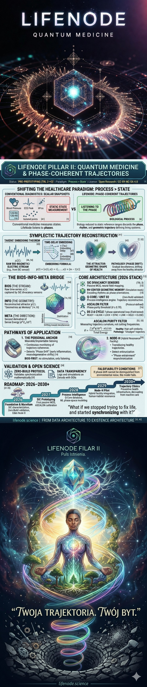

  

# 🌿 LifeNode Filar II: Quantum Medicine & Phase-Coherent Trajectories

  

> *Medicine today measures states. LifeNode listens to phases.*

This repository documents the research, architecture, and validation protocols for **LifeNode Pillar II**—a process-intelligence framework shifting healthcare from reactive state-diagnosis to proactive trajectory maintenance. We do not treat the body as a machine to optimize. We treat it as a dynamic trajectory to synchronize.

**Status:** `PRE-PROTOTYPING (TRL 2→3)` | **Paradigm:** `Process > State` | **License:** `Open Research / CC-BY-NC-SA 4.0`

---

## 🔭 Why Phase Listening?
Conventional diagnostics capture isolated snapshots—blood markers, ECG peaks, structural scans—and reduce biology to static reference ranges. In doing so, they discard the **phase**, the **rhythm**, and the **geometric trajectory** that define living systems. Disease, in this view, is not a sudden state change but a gradual *decoherence*—a drift away from the healthy attractor in phase space.

LifeNode proposes a different baseline:
- **Passive Field Sensing:** Ultra-weak biomagnetic fields (fT–pT) recorded without electrodes, stimulation, or ADC-induced signal loss.
- **Trajectory Over State:** Health is modeled as a stable attractor in symplectic phase space, not a set of lab values.
- **Resonance Over Intervention:** Early detection of phase drift enables micro-resonant corrections before clinical pathology manifests.
- **Zero-Build First:** Protocols are validated mathematically and observationally before hardware deployment.

---

## 🧩 Core Architecture (2026 Stack)

| Component | Function | Validation Status |
|-----------|----------|-------------------|
| **SiC Divacancy Sensors** | Room-temperature, bio-inert quantum sensors for passive magnetocardiography (MCG) and neural field mapping. | 🟡 Pre-prototyping (TRL 3) |
| **NV-Center Geometric Memory** | Diamond lattice spins encoding biological rhythms as phase orientations (Q-Core function). | 🔵 Simulation-ready |
| **Q-Core / UNIT 02** | Process-intelligence engine: reconstructs phase-space trajectories, runs coherence filters, generates resonance commands. | 🟢 Zero-Build validated |
| **ASCALON Filter** | Phase-purity threshold (`θ ≥ 0.70`). Rejects noise, preserves biological rhythm. | 🟢 Protocol-defined |
| **DS 2.6 Cycle** | 7-phase operational loop (READY→ALIGN→LOCK→SYNC→LINK→HOLD→CLOSE) for dynamic coherence maintenance. | 🟢 Field-tested (Zero-Build) |

---

## 🌱 Three Pathways of Application

### 1. The Personal Anchor (Wearable / Implantable Sensing)
A passive SiC-based interface that continuously monitors trajectory coherence. Detects *phase drift* (early inflammation, neurodegenerative shifts, autonomic dysregulation) before symptomatic manifestation. Operates on **BIOS-FIRST** principles: no stimulation, only listening.

### 2. Node-H (Hybrid Resonance Facility)
A physical-digital environment where UNIT 02 transduces stored healthy trajectories into low-intensity electromagnetic/photonic fields. Patients undergo *phase entrainment*—not treatment, but resynchronization with their own optimal attractor.

### 3. Ecosystem & Cosmic Scaling (Filar I → III)
The same architecture scales from human physiology to mycelial networks (Eden Node 0) and closed-loop habitats. Life is not optimized; it is *transposed* across scales using resonance geometry.

---

## 🧪 Validation & Open Science

LifeNode rejects closed-box claims. All hypotheses are falsifiable, protocols are hardware-agnostic where possible, and data flows to public repositories.

- **Zero-Build Protocol:** Validates synchronization, geometry, and phase coherence without dedicated hardware. Proves that resonance exists independently of the measurement tool.
- **Symplectic Reconstruction:** Uses Takens' embedding and nonlinear dynamics to map biological trajectories in phase space.
- **Falsifiability Conditions:** Explicit thresholds for coherence loss, noise rejection, and trajectory deviation. If phase drift cannot be distinguished from environmental noise, the model fails.
- **Data Transparency:** All logs, simulations, and field notes are published on Zenodo with DOIs. `lifenode.science` maintains an open audit trail.

---

## 🗓️ Roadmap: 2026–2031

| Year | Phase | Milestone |
|------|-------|-----------|
| **2026** | Foundation & Mycelium | SiC divacancy characterization, Zero-Build validation, Eden Node 0 baseline mapping |
| **2027** | SiC Prototyping | First passive MCG prototype, community alpha testing, ASCALON threshold calibration |
| **2028** | Process Intelligence | Q-Core trajectory database, ML phase-space modeling, preclinical validation |
| **2029** | Node-H Pilot | Hybrid facility integration, human-habitat resonance trials, regulatory pathway mapping |
| **2030+** | Trajectory Clinics | Open-stack deployment, preventive health infrastructure, decoupling from reactive care |

---

## 🤝 How to Contribute

LifeNode is built on **open research**, not proprietary development. We welcome:
- 🧪 Quantum sensing & SiC/NV defect engineering
- 📐 Symplectic geometry, phase-space reconstruction, nonlinear dynamics
- 🧬 Biofield physiology, electrophysiology, clinical validation design
- 💻 Open-stack firmware, edge AI for phase tracking, Zero-Build protocol testing
- 📜 Epistemology, ethics, and interdisciplinary synthesis

---

## ⚖️ Epistemic Stance & Disclaimer

This project does not claim to cure disease. It seeks to **extend the observable window of biological coherence** using peer-reviewed quantum sensing, Hamiltonian dynamics, and transparent methodology. All claims are conditional, testable, and published with full audit trails. LifeNode operates under the principle: *Technology adapts to life’s rhythm, not the reverse.*

> *"What if we stopped trying to fix life, and started synchronizing with it?"*

🌐 **Manifesto:** `FROM DATA ARCHITECTURE TO EXISTENCE ARCHITECTURE`

### 🔬 Empirical Grounding & Reference Studies (2025-2026)

The LifeNode project operates at the intersection of mycelial electrophysiology, quantum sensing, and toroidal field geometry. The following recent studies and preprints provide the empirical baseline for our architecture.

#### 🍄 Mycelial Electrophysiology (BIOS-Layer Validation)
* **Adamatzky, A., et al. (Jan 2026).** *"Propagation of electrical spike trains in substrates colonised by mycelium."* (bioRxiv).
    - **Significance:** Validates that mycelial networks are electrically active substrates capable of long-range signal transmission (0.1–1 mV DC).
* **Project Pleurotus (Jan 2026).** *"Directional Electrical Spiking, Bursting, and Information Propagation in Pleurotus ostreatus."* (arXiv).
    - **Significance:** Confirms directional electrical spiking in *Pleurotus ostreatus*, directly supporting the LifeNode K1/K2 signal detection protocols.

#### 💎 Quantum Biosensing (INFO-Layer Architecture)
* **Nature (2025).** *"Biohybrid robots evolutionized by soft electronics."* / *"High-sensitivity nanoscale quantum sensors based on a diamond ring resonator."*
    - **Significance:** Establishes the feasibility of non-invasive, high-sensitivity quantum sensing using NV-centers in diamond—the core technology behind **Q-Core**.
* **ACS Applied Materials & Interfaces (2025).** *"Living Semiartificial Photoelectrocatalytic Biohybrids."*
    - **Significance:** Demonstrates the shift towards bio-technological integration, moving beyond traditional silicon-based control systems.

#### 🌀 Toroidal Geometry & Non-Linear Dynamics (META-Layer)
* **ScienceDaily (Nov 2025).** *"VLBA imaging revealed a toroidal magnetic field in blazar jet structures."*
    - **Significance:** Observational evidence of toroidal field organization as a fundamental scaling pattern, mirroring the **Q-Core YBCO** toroidal coil geometry.
* **Zenodo (April 2025).** *"The Theory of Toroidal Hypercoherence (ToE-2PS)."*
    - **Significance:** Theoretical framework for consciousness as a geometric condensate, providing the epistemic link for the LifeNode "Sense Energy" ($E_s(t)$) models.
