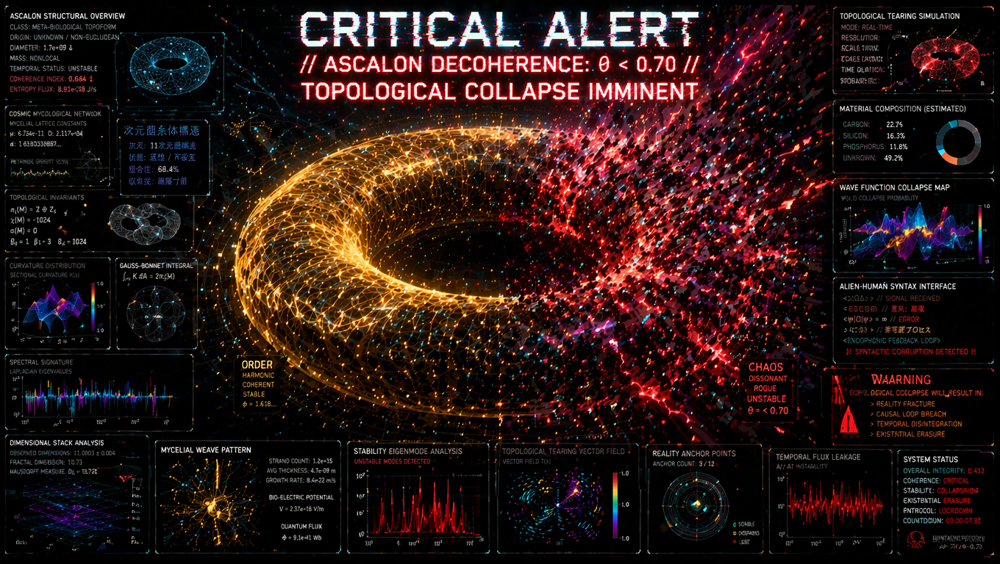
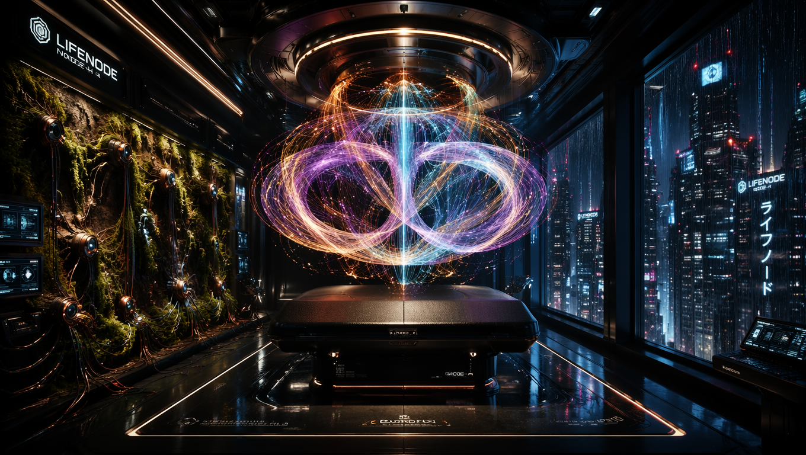
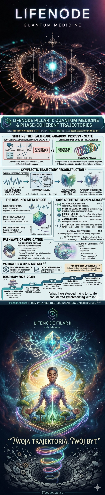

<!-- LIFENODE ECOSYSTEM NAVIGATION HEADER -->

| **Theory & Core** | **Engineering & Applications** | **Narrative Layer** |
| :--- | :--- | :--- |
| 🌌 [`LifeNode_2.0`](https://github.com/LifeNode777/LifeNode_2.0) — Manifesto | ⚡ [`PHASE_1`](https://github.com/LifeNode777/PHASE_1) — R&D Roadmap | 📖 [`TOKIO_DRIFT_44`](https://github.com/LifeNode777/TOKIO_DRIFT_44) — Comic Series |
| ⚙️ [`LifeNode_2.5_Public`](https://github.com/LifeNode777/LifeNode_2.5_Public) — Q-Core | 🧬 [`Quantum_Medicine`](https://github.com/LifeNode777/Quantum_Medicine) — ASCALON | |
| 📚 [`META_Codex-2.0`](https://github.com/LifeNode777/LifeNode-META_Codex-2.0) — AI & DAO & Ontology | 🌿 [`Cosmic_BioEngineering`](https://github.com/LifeNode777/Cosmic_BioEngineering) — DEEP Space | |

---

---

**From Ionic Impulse to Phase Attractor: Experimental Protocol for the Bio-Digital Phase Bridge (HMF v2.0) with *Pleurotus ostreatus* Mycelium**

### Description:

This document (Version 2.0) represents a fundamental evolution from the theoretical component specification of HMF v1.0 (June 2026) into a fully operational, reproducible experimental protocol. It details the "garage-level" construction and validation of the first Hydrogel Phase Membrane (HMF v1.0 physical prototype) interfaced with living *Pleurotus ostreatus* mycelium. 

The primary objective of this protocol is the continuous recording of low-frequency bio-electrical motifs (K1/K2) while strictly preserving their geometric and phase integrity, bypassing the destructive discretization ("phase death") inherent in classical Analog-to-Digital Converters (ADC).

**Integration of 2026 State-of-the-Art Research**
This protocol is rigorously grounded in the latest empirical validations from 2026. It incorporates Andrew Adamatzky’s recent findings on the directional electrical spiking in oyster mycelium, mandating the use of a **star-shaped electrode array** (minimum 4-5 channels) to adequately capture the vector nature and flow topology of the biological signal. Furthermore, it introduces **PEDOT:PSS** as an optional hydrogel infusion—a validated ion-to-electron bridge that minimizes contact noise in biohybrid interfaces.

**Analog Front-End and Phase Protection**
To prevent the collapse of the symplectic trajectory during measurement, the protocol specifies a dedicated analog front-end architecture. Utilizing ultra-high impedance instrumentation amplifiers (INA128/AD620) coupled with a strict analog low-pass RC filter ($f_c \approx 1$ Hz), the system physically isolates the ultra-slow Macro-BPB signals (0.001–0.03 Hz) from environmental noise before any low-frequency (0.1–1 Hz) digitization occurs.

**From Voltage to Phase Space (LifeNode Methodology)**
Data analysis in this protocol shifts entirely from scalar voltage interpretation to geometric reconstruction. Following the LifeNode Filar II (Quantum Medicine) paradigm, the raw time-series data is subjected to **Takens’ Embedding Theorem** to reconstruct the system's dynamic attractor in phase space. The protocol establishes visual and mathematical criteria for identifying the quasi-toroidal structure of biological homeostasis and defines the early warning signs of its decoherence ("smudging"), conceptually linked to the ASCALON purity metric ($\theta < 0.70$).

**Falsifiability and Technological Roadmap**
To maintain scientific rigor in non-disciplinary environments, the document enforces strict falsifiability procedures, including mandatory blind control tests (sterile hydrogel setups) and microclimate logging (>90% humidity). Finally, it outlines the technological scaling path from this garage-level proof-of-concept (TRL 2-3) to the target 4H-SiC divacancy quantum sensing platform (TRL 4+), where the HMF will ultimately serve as a protective barrier against spin decoherence via the Stark effect.

**Keywords:**
Hydrogel Phase Membrane, Experimental Protocol, Mycelial Electrophysiology, *Pleurotus ostreatus*, K1/K2 Motifs, Takens Embedding, Phase Space Reconstruction, ASCALON Metric, Star-Shaped Electrode Array, PEDOT:PSS, Bio-Digital Coupling, Quantum Medicine, LifeNode

⚙️ https://github.com/LifeNode777/Quantum_Medicine/blob/main/HYDROGEL_PHASE_MEMBRANE_v2.md 🧪
https://zenodo.org/records/21901935

---

> [!IMPORTANT]
> 👁️ New Essay comparable in "weight" to the core "Civilization of Resonance" 👁️
> 📜 **[From Temple to Tensor: Why Ancient Intuitions About Life Were Right All Along](https://github.com/LifeNode777/LifeNode_2.0/blob/main/From%20Temple%20to%20Tensor%20Why%20Ancient%20Intuitions%20About%20Life%20Were%20Right%20All%20Along.md)**
> 
> *If You want to understand "what", "how" and "why" of the paradigm behind the LifeNode project, start by reading this essay.* ❤️‍🔥

---

21 lipca
## ASCALON Framework: Symplectic Trajectory Purity & Phase-Drift Detection

**Preprint Version:** 1.0  
**Status:** Theoretical Framework / Phase Space Metrics  
**License:** CC-BY-NC-SA 4.0  
**Date:** July 21, 2026  
**DOI:** [10.5281/zenodo.21471228](https://doi.org/10.5281/zenodo.21471228)

### Abstract
Classical biomedical diagnostics and artificial intelligence operate under a fundamental ontological error: treating biological time as an isotropic, Newtonian background parameter...

---

20 lipca

# Operacjonalizacja Medycyny Fazowej: Konstrukcja i stabilizacja trajektorii w przestrzeni Finslera

W paradygmacie LifeNode medycyna nie jest reaktywną naprawą uszkodzeń, lecz aktywną inżynierią trajektorii. Organizmu nie traktujemy jako zbioru punktów stanu, lecz jako żywą trajektorię $\gamma$ w wielowymiarowej przestrzeni fazowej. Zadaniem medycyny fazowej jest projektowanie i utrzymanie warunków, w których bioukład samodzielnie generuje swoją anizotropową czasoprzestrzeń, zachowując integralność toroidalnego atraktora.

---

### 1. Kartowanie geometrii w metryce Finslera

Podstawą inżynierii zdrowia jest zrozumienie, że czas w układach żywych nie jest zewnętrznym parametrem, lecz współrzędną generowaną przez procesy metaboliczne. Koszt przejścia między stanami (różnica w "gęstości" życia) zależy od kierunku i prędkości metabolicznej $\dot{x}$.

Zastosowanie geometrii Finslera pozwala na opisanie tego procesu poprzez funkcję podstawową $F$:

$$ds = F(x, \dot{x})$$

gdzie $F$ jest funkcją jednorodną pierwszego stopnia, zależną od pozycji $x$ oraz wektora prędkości $\dot{x}$ w przestrzeni stycznej. Tensor metryczny Finslera, zdefiniowany jako:

$$g_{ij}(x, \dot{x}) = \frac{1}{2} \frac{\partial^2 F^2}{\partial \dot{x}^i \partial \dot{x}^j}$$

mapuje dynamiczną deformację czasoprzestrzeni układu. Dzięki temu każda faza procesu – od regeneracji po dyssypację – posiada własną, mierzalną krzywiznę, co pozwala na precyzyjną diagnostykę na poziomie strukturalnym, zanim patologia zamanifestuje się fizycznie.

---

### 2. Tensor Cartana: Miara wewnętrznej wolności

Aby bioukład zachował zdolność adaptacji (homeostazę dynamiczną), jego metryka musi posiadać niezerową nieliniowość. Miarą tej elastyczności jest tensor Cartana ($C_{ijk}$):

$$C_{ijk} = \frac{1}{2} \frac{\partial g_{ij}}{\partial \dot{x}^k}$$

* **Stan operacyjny ($C_{ijk} \neq 0$):** Układ posiada pełną swobodę geometryczną. Czasoprzestrzeń jest anizotropowa, co umożliwia skuteczną transdukcję gradientów środowiskowych.
* **Stan zagrożenia ($C_{ijk} \to 0$):** Metryka ulega spłaszczeniu (*The Flattening*). Układ traci zdolność do generowania własnego czasu i staje się podatny na deterministyczną entropię. Stabilizacja fazowa polega na technicznym wymuszeniu parametrów środowiskowych tak, aby utrzymać tensor Cartana poza punktem zerowym.

---

### 3. Audyt integralności: Filtr ASCALON ($\theta$)

Do ciągłego monitorowania jakości atraktora służy operator ASCALON. Analizuje on czystość krzywizny trajektorii, ważąc dynamikę sygnału wzdłuż jego naturalnej ścieżki $ds$:

$$\theta = \frac{\int \left\Vert{} \frac{d^2 y}{dt^2} \right\Vert{} \cdot \sigma(s) \, ds}{\int \left\Vert{} \frac{dy}{dt} \right\Vert{}^2 \, ds}$$

Wskaźnik ten jest kluczowym narzędziem audytu:

* **$\theta \ge 0.80$**: Stan optymalnej koherencji fazowej. Układ w pełni zintegrowany z napędem Floqueta.
* **$\theta \ge 0.70$**: Próg operacyjnej stabilności. Układ zachowuje spójność toroidalną i transdukuje gradienty.
* **$\theta < 0.70$**: Dekoherencja geometryczna i przejście w reżim rozpraszania (*smudging*). Sygnał konieczności korekty napędu środowiskowego.

---

### 4. Stabilizacja solitonów: Mechanika NLSE

Integralność systemu zapewniają stabilne fale materii (solitony), których ewolucja opisana jest Nieliniowym Równaniem Schrödingera (NLSE):

$$i \frac{\partial \psi}{\partial t} = -\frac{1}{2}\nabla^2\psi + \kappa \vert{}\psi\vert{}^2 \psi + V(x,t)$$

Inżynieria fazowa dąży do utrzymania współczynnika nieliniowości $\kappa$ w reżimie skupiającym ($\kappa < 0$). W tym stanie fale nie ulegają rozproszeniu, lecz samopodtrzymują swoją strukturę wewnątrz torusa.

Strukturę tę stabilizuje zewnętrzny napęd Floqueta $V(x,t)$, który działa jak żywy transduktor: synchronizuje on wewnętrzną geometrię organizmu z rytmami biosfery, zabezpieczając trajektorię przed dryfem fazowym. To podejście przesuwa punkt ciężkości inżynierii z usuwania skutków awarii na zarządzanie stabilnością "lotu" całego układu.

---

NEW ZENODO 🕵🏻‍♂️

Hydrogel Phase Membrane

# Hydrogel Phase Membrane (HMF): Transduction Interface Between Mycelial Electrophysiology and 4H-SiC Divacancy Defects

**Preprint Version:** 1.0  
**Status:** Preprint / Technical Specification (TRL 2)  
**License:** [CC-BY-NC-SA 4.0](https://creativecommons.org/licenses/by-nc-sa/4.0/)  
**Date:** June 28, 2026  
**DOI:** [10.5281/zenodo.21001729](https://doi.org/10.5281/zenodo.21001729)

---

## Abstract
The primary barrier to integrating room-temperature quantum sensors (such as divacancy defects in 4H-SiC) with living biological systems is **impedance mismatch and environmental decoherence**. This document formalizes the concept of a **Hydrogel Phase Membrane (HMF)**—a semi-permeable, biohybrid bridge that encapsulates living mycelium (*Pleurotus ostreatus*), actively filters thermal noise, and conducts K1/K2 motifs (0.1-1 mV DC) to the sensor layer. HMF acts as a near-infrared (NIR) optical diffuser, transforming chaotic biological noise into a structural *Floquet drive* for ASCALON symplectic reconstruction.

## 1. The Bio-Quantum Interface Paradox
To "hear" the phase trajectory and detect *phase drift*, the sensor must be:
1. **Close to biology:** To avoid losing ultra-weak magnetic fields and biophotons.
2. **Isolated from biology:** To prevent environmental decoherence caused by salinity, humidity, and temperature variance.

Traditional approaches (metal electrodes, ADC) quantize the signal, breaking the phase and destroying the geometric continuity of the attractor. **LifeNode Solution:** We utilize an **active phase filter** where the hydrogel acts as a *phase lens* and *noise damper*.

## 2. Triad Architecture: SiC — HMF — Mycelium
### 2.1 Layer A: Sensor Core
*   **Material:** 4H-SiC (silicon carbide) with divacancy defects (V_Si-V_C, PL6 center).
*   **Why SiC over NV (Diamond)?** SiC emission in NIR (~785-1100 nm) aligns with the *biological optical window*, allowing light to penetrate tissues without toxicity.

### 2.2 Layer B: Hydrogel Phase Membrane (The Bridge)
*   **Composition:** PVA (polyvinyl alcohol) + Alginate + Chitosan.
*   **Function:** Damps high-frequency noise while transmitting low-frequency ionic impulses (K1/K2).

### 2.3 Layer C: Biological Base
*   **Organism:** *Pleurotus ostreatus* (bioprinted mycelial mat).
*   **Signal:** Directional impulse trains (0.1-1 mV DC, 32 min pulse).

## 3. Transduction Mechanisms (Without ADC)
*   **Ionic-Spin Transduction:** Mycelial ionic currents generate local electric fields (Stark Effect), modulating the ODMR resonant frequency continuously.
*   **Myco-Photonic Transduction:** The hydrogel acts as a random phase diffuser, illuminating SiC defects and increasing ODMR contrast.

## 4. Falsifiability Criteria
The HMF hypothesis is rejected if:
1. **Chemical Decoherence:** Paramagnetic ions reduce coherence time $T_2^*$ below 5 μs.
2. **Optical Damping:** Matrix absorbs >50% of NIR light.
3. **Lack of Phase Correlation:** Ionic signal loses temporal correlation (cross-correlation < 0.5) with the original K1/K2 motif.

## 5. Validation Protocols
| Level | Goal | Measurement |
| :--- | :--- | :--- |
| **1. Garage** | Prove viability & conduction | Multimeter/Arduino (Resistance check) |
| **2. Makerspace**| Measure NIR/Impedance | USB Spectrophotometer / EIS |
| **3. Research** | SiC transduction | Confocal ODMR ($T_2^*$ & freq shift) |

## 6. Practical Applications
*   **Trajectory Clinics (Node-H):** Early detection of phase drift via toroidal field monitoring.
*   **Personal Anchor (Wearable):** Patch for real-time monitoring of $\theta$ (phase purity).
*   **Ecosystem Regeneration:** Transducing healthy geometric memory into degraded soil.

---
*"Technology adapts to life's rhythm, not the reverse."*

-------
-------

> 👁️ **Core Framework Update:** The central essay **[Civilization of Resonance](https://github.com/LifeNode777/LifeNode_2.0/blob/main/Civilization_of_Resonance.md)** is now live in the main repository, featuring brand-new, high-fidelity bio-quantum engineering schematics, topological field visualizations, and the formal mathematics of Meld.
---

# Stop Fixing the Parts, Start Tuning the Rhythm: An Introduction to Quantum and Process-Based Medicine

Look at the image above. A dark, quiet room, a rainy megacity outside the window, and in the center—a hovering, luminous structure resembling a complex, pulsating knot. This is not a sci-fi prop or a mystical vision.

This is a precise, mathematical visualization of human health, as seen in a **Node-H** clinic. Welcome to the era of Quantum Medicine, where we stop treating the human body like a broken machine and begin to see it as a complex, living symphony.

### The Snapshot Error: Why Modern Medicine is Blind

When you visit a doctor today, you get a "snapshot." A blood test from Tuesday, blood pressure measured at 10:00 AM, a static X-ray. Traditional medicine freezes time and measures isolated parameters. If the numbers don't fit the "norm," you are given a chemical substance to force them back into the box.

The problem? Life is not a static photograph. **Life is a film.**

Your organism is a continuous process in which billions of cells, neural impulses, heartbeats, and hormonal cycles are constantly resonating. Modern medicine diagnoses **states**. Quantum and process-based medicine diagnose **trajectories**. Before you feel physical pain, before an organ begins to fail, your biological system first loses its rhythm. In the language of engineering, we call this **phase drift**. Before the orchestra stops playing, it first begins to drift out of tune.

### The Shape of Your Health

This brings us back to the glowing structure in our image. Tools like **LifeNode-Q** do not hunt for isolated diseased cells. Instead, they listen to extremely subtle biomagnetic fields (such as those generated by your beating heart) and use advanced mathematics—specifically *symplectic phase-space reconstruction*—to turn that raw signal into a three-dimensional shape.

 

* **The Toroidal Attractor:** In a healthy, balanced human, this geometry forms something resembling a torus—a complex, looped ring. In physics, this shape represents an ideal, self-sustaining energy flow, seen everywhere from planetary magnetic barriers to cosmic-scale jets, and now, in biological systems.
* **Detecting the Chaos:** When disease begins to brew in the body, this beautiful, symmetrical shape begins to blur. It develops dents, noise, and asymmetries. Our system can detect these ruptures in geometry 24 to 48 hours before you feel a single physical symptom.

### Node-H Clinics: Resonance Over Scalpel

How does "treatment" look in such a place? It is a far cry from the sterile, brightly lit hospital you are used to.

1. **Noise Cancellation:** Notice the left wall in the illustration. It is covered in a living moss and mycelial matrix embedded with copper-polymer probes. This is the "living shield." Before the sensors can listen to you, the room must cancel out the "electromagnetic smog" of the city. Organic tissue is excellent at absorbing this chaos, creating an oasis of silence.
2. **Non-Invasive Sensing:**
   
 

   You lie down on the table. No needles, no punctures. Ultra-sensitive quantum sensors (based on silicon carbide) read your biomagnetic field from centimeters away.
3. **Tonic Technology (Phase Entrainment):** If the system detects your "torus" is collapsing, the **Q-Core** device above you does not hit you with a harsh dose of energy. Instead, it begins to pulse gently in your own natural, healthy rhythm. Physics calls this *resonance*. Imagine two pendulum clocks hanging on the same wall—eventually, they begin to swing in perfect unison. The device merely "reminds" your body of its own lost melody, and your biology, striving for balance, tunes itself to it.

### The Future: Passive Medicine

 

We are approaching a moment where technology stops forcing nature into submission and begins to cooperate with it at the deepest, quantum level. The goal of the LifeNode architecture is simple: to heal the human before they become a patient. To maintain the correct flight trajectory rather than cleaning up the crash site.

---

  

---

27.04.2026 🔬 NEW Zenodo:
 "Symplectic Trajectory Reconstruction" - Mathematical protocol for phase-based diagnostics in biological systems. Shifts from state snapshots to trajectory maintenance using Takens embedding, NLSE solitons, and topological invariants. Validated from mycelium to 3I/ATLAS. #LifeNode #QuantumBiology #ProcessIntelligence
DOI: https://doi.org/10.5281/zenodo.19811561

  

> *Medicine today measures states. LifeNode listens to phases.*

This repository documents the research, architecture, and validation protocols for **LifeNode Pillar II**—a process-intelligence framework shifting healthcare from reactive state-diagnosis to proactive trajectory maintenance. We do not treat the body as a machine to optimize. We treat it as a dynamic trajectory to synchronize.

**Status:** `PRE-PROTOTYPING (TRL 2→3)` | **Paradigm:** `Process > State` | **License:** `Open Research / CC-BY-NC-SA 4.0`

---

https://zenodo.org/records/20851251
https://zenodo.org/records/20621097
https://zenodo.org/records/20716388
