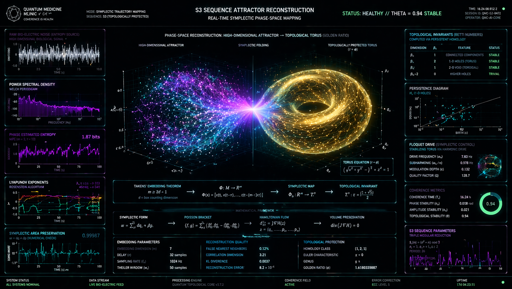

# Real-Time Symplectic Phase-Space Mapping (S3 Sequence Attractor Reconstruction)



## 1. Header & System Status

* **Clinic / Institution:** QUANTUM MEDICINE CLINIC (`COHERENCE IS HEALTH`)
* **Mode:** SYMPLECTIC TRAJECTORY MAPPING
* **Sequence:** S3 (TOPOLOGICALLY PROTECTED)
* **Core Operation:** S3 SEQUENCE ATTRACTOR RECONSTRUCTION // REAL-TIME SYMPLECTIC PHASE-SPACE MAPPING
* **Global Health Status:** `STATUS: HEALTHY // THETA = 0.94 STABLE`
* **Metadata:**
  * **Time:** `16:24:08.912.2`
  * **Session ID:** `QMC-S3-9472`
  * **Operator:** `QMC-AI-CORE`

---

## 2. Left Panel: Signal Diagnostics & Entropy Analysis

### Raw Bio-Electric Noise (Entropy Source)
* **Sub-label:** HIGH-DIMENSIONAL BIOLOGICAL SIGNAL
* **X-Axis:** TIME (s) `[0.0 to 10.0]`
* **Y-Axis:** Amplitude `[-1.0 to 1.0]`

### Power Spectral Density
* **Sub-label:** WELCH PERIODOGRAM
* **X-Axis:** FREQUENCY (Hz) `[10^0 to 10^2]`
* **Y-Axis:** PSD (dB/Hz) `[-20 to -140]`

### Phase Estimated Entropy
* **Sub-label:** MPE ($m = 3, \tau = 10$)
* **Current Value:** `1.87 bits`
* **X-Axis:** TIME (s) `[0 to 100]`
* **Y-Axis:** PHASE ENTROPY `[0.0 to 2.5]`

### Lyapunov Exponents
* **Sub-label:** ROSENSTEIN ALGORITHM
* **Telemetry Data:** 
  * $\lambda_1 = 0.322$ (Chaotic Attractor Indicator)
  * $\lambda_2 = -0.114$
  * $\lambda_3 = -0.541$
* **X-Axis:** TIME (s) `[0 to 100]`
* **Y-Axis:** $\lambda$ `[-1.0 to 0.5]`

### Symplectic Area Preservation
* **Sub-label:** $\omega = dq \wedge dp$ (NUMERICAL CHECK)
* **Current Value:** `0.99987`
* **X-Axis:** TIME (s) `[0 to 100]`
* **Y-Axis:** Differential Variance `[10^-3 to 10^-5]`

---

## 3. Central Engine: Phase-Space Reconstruction Pipeline

**Main Visualization Header:** PHASE-SPACE RECONSTRUCTION: HIGH-DIMENSIONAL ATTRACTOR $\rightarrow$ TOPOLOGICAL TORUS (GOLDEN RATIO)

* **Left State:** HIGH-DIMENSIONAL ATTRACTOR (Chaotic cloud phase)
* **Transition Mechanism:** SYMPLECTIC FOLDING
* **Right State (Target):** TOPOLOGICALLY PROTECTED TORUS ($\tau \rightarrow \phi$)

### Torus Geometric Equation
$$\left(\sqrt{x^2 + y^2} - 3\right)^2 + z^2 = 1$$

### Mathematical Pipeline (Takens to Topology)

1. **Takens' Embedding Theorem:**
   $$m \ge 2d + 1$$
   *(where $d =$ box counting dimension)*
   $$\rightarrow \Phi : M \rightarrow \mathbb{R}^m$$
   $$\Phi(x) = [\xi(t), \xi(t-\tau), \dots, \xi(t-(m-1)\tau)]$$

2. **Symplectic Map:**
   $$\rightarrow \Phi_s : \mathbb{R}^m \rightarrow T^n$$

3. **Topological Invariant:**
   $$\rightarrow T^n : \phi = \frac{1 + \sqrt{5}}{2}$$

---

## 4. Center-Bottom: Core Mathematical Framework

### Symplectic Form
$$\omega = \sum_{i} dq_i \wedge dp_i$$

### Poisson Bracket
$$\{f, g\} = \sum_{i} \left( \frac{\partial f}{\partial q_i}\frac{\partial g}{\partial p_i} - \frac{\partial f}{\partial p_i}\frac{\partial g}{\partial q_i} \right)$$

### Hamiltonian Flow
$$\dot{z} = J \nabla H(z)$$
$$z = (q_1, \dots, q_n, p_1, \dots, p_n)$$

### Volume Preservation (Liouville's Theorem)
$$\text{div}(J \nabla H) = 0$$

---

## 5. Bottom Diagnostics Matrix

| Embedding Parameters | Reconstruction Quality | Topological Protection |
| :--- | :--- | :--- |
| **Embedding Dimension ($m$):** 7 | **False Nearest Neighbors:** 0.12% | **Homology Class:** [1, 2, 1] |
| **Delay ($\tau$):** 32 samples | **Correlation Dimension:** 3.21 | **Euler Characteristic ($\chi$):** x = 0 |
| **Sampling Rate ($f_s$):** 1024 Hz | **KL Divergence:** 0.0037 | **Genus ($g$):** 1 |
| **Theiler Window ($w_t$):** 50 samples | **Reconstruction Error:** $8.2 \times 10^{-6}$ | **Golden Ratio ($\phi$):** 1.6180333887 |

---

## 6. Right Panel: Homology & Control Metrics

### Topological Invariants (Betti Numbers)
*Sub-label: COMPUTED VIA PERSISTENT HOMOLOGY*

| Dimension | $\beta_n$ | Feature | Status |
| :--- | :--- | :--- | :--- |
| $\beta_0$ | 1 | CONNECTED COMPONENTS | **STABLE** |
| $\beta_1$ | 2 | 1-D HOLES (TORUS) | **STABLE** |
| $\beta_2$ | 1 | 2-D VOID (TOROIDAL) | **STABLE** |
| $\beta_n, n > 2$ | 0 | HIGHER HOLES | **TRIVIAL** |

### Persistence Diagram
* **Sub-label:** $H_1$ (1-D HOLES)
* **X-Axis:** BIRTH ($b$) `[10^-3 to 10^1]`
* **Y-Axis:** DEATH ($d$) `[10^-3 to 10^1]`

### Floquet Drive (Symplectic Control)
* **Sub-label:** STABILIZING TORUS VIA HARMONIC DRIVE
* **Drive Frequency ($\omega_d$):** 7.83 Hz
* **Subharmonic ($\omega_d / n$):** 0.978 Hz
* **Modulation Depth ($\epsilon$):** 0.132
* **Quality Factor ($Q$):** 128.7

### Coherence Metrics
* **Coherence Time ($T_c$):** 16.24 h
* **Phase Stability ($\sigma_\phi$):** 0.018 rad
* **Amplitude Stability ($\alpha_s$):** 0.021
* **Topological Stability ($\theta$):** 0.94 *(Visualized on the primary radial dial)*

### S3 Sequence Parameters
* **Sub-label:** TRIPLE MODULAR REDUCTION
* **Generative Equation:**
  $$S_3(n) = (a^n + n) \pmod 2$$
  *Parameters:* $a_1 = 1, a_2 = 1, b_1 = 2$
  *Periodicity:* **PERIOD: 26**

---

## 7. System Footer Baseline

```bracket
[SYSTEM STATUS: ALL SYSTEMS NOMINAL]  |  [DATA STREAM: LIVE BIO-ELECTRIC FEED]  |  [PROCESSING ENGINE: QUANTUM TOPOLOGICAL CORE v3.7.2]  |  [COHERENCE FIELD: ACTIVE]  |  [ERROR CORRECTION: ECC LEVEL 5]  |  [UPTIME: 17d 04:23:11]
