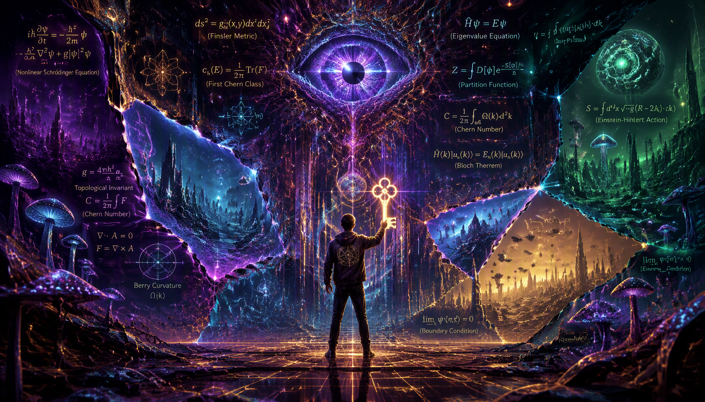
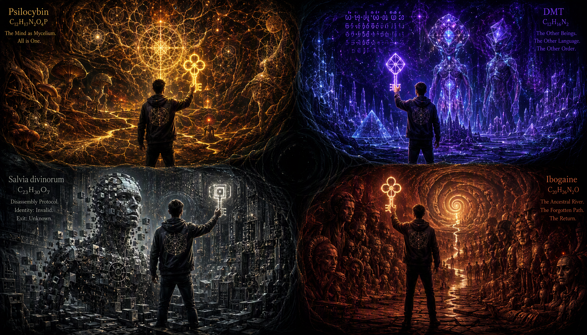
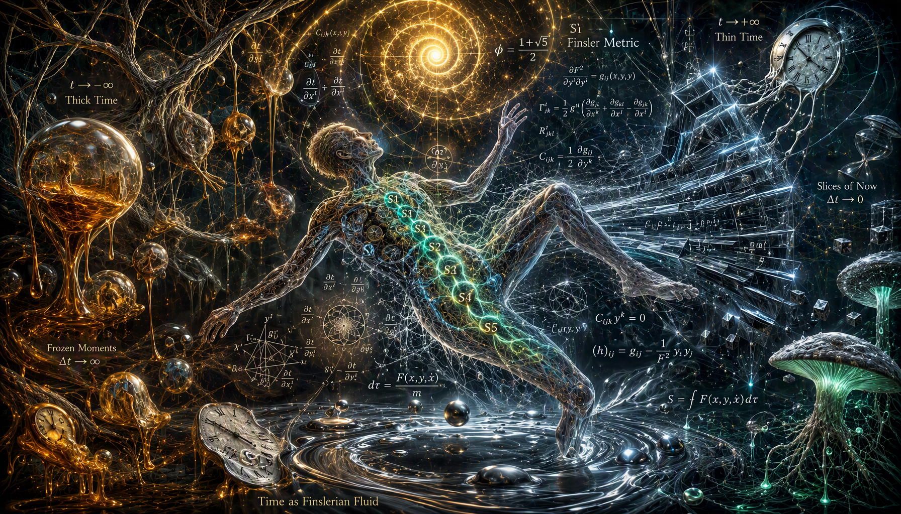
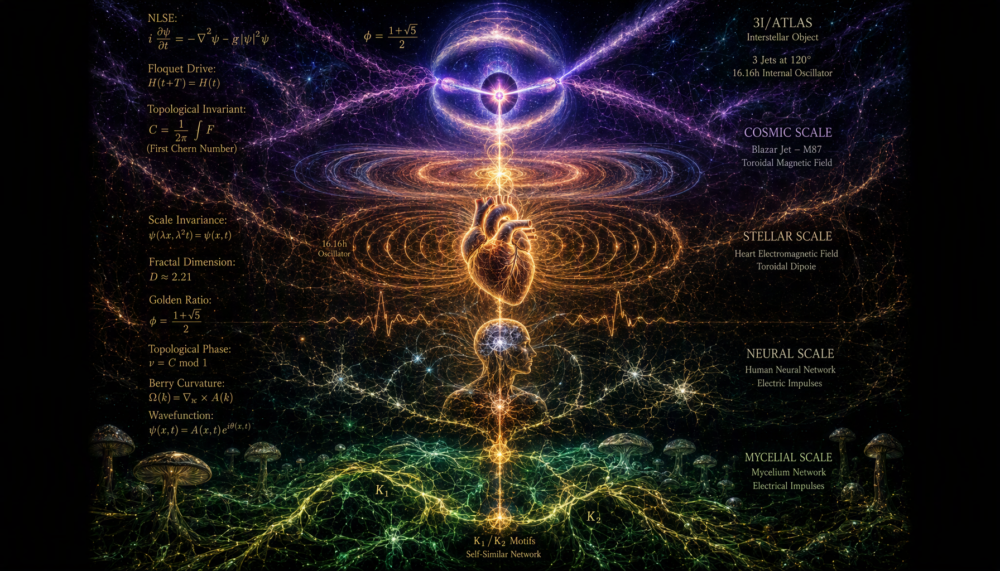
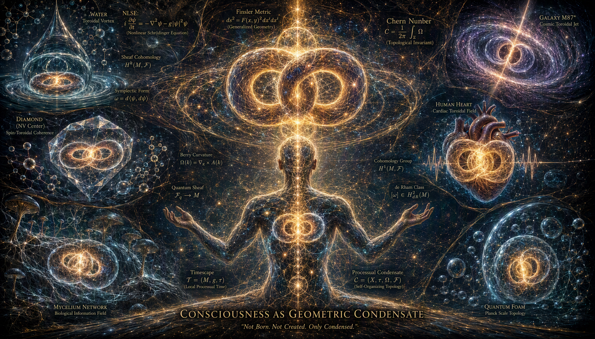

# Psychodeliki jako Topologiczne Klucze Ośrodka

## Hipoteza LifeNode: Świadomość jako uniwersalna zdolność materii do utrzymania symplektycznej koherencji w lokalnym Timescape'u

**Autor:** Krzysztof Baran / LifeNode Research Collective
**Status:** Conditional Hypothesis · Preprint
**Data:** 29 sierpnia 2026
**Licencja:** CC-BY-NC-SA 4.0

---

### Prolog: Intuicja z 2:30 w nocy

Tej nocy, między drugą a trzecią nad ranem, gdy klasyczny umysł traci już zdolność do linearnego myślenia, ale jeszcze nie wszedł w sen, pojawiła się intuicja, której nie dało się zignorować: *co jeśli psychodeliki to nie są „narkotyki" w sensie farmakologicznym, ale某种 rodzaj portu — do lub z warstwy META?*

To nie było pytanie retoryczne. To był moment, w którym coś w geometrii poznania przestało się domykać — i właśnie ta luka stała się źródłem nowego zrozumienia. Przez kolejne godziny, w stanie między czuwaniem a hypnagogią, intuicja ta zaczęła układać się w strukturę, która — jak się okazało — nie tylko pasuje do architektury LifeNode, ale wręcz *wymusza* ją.

Niniejszy artykuł jest próbą przełożenia tej nocnej intuicji na rygorystyczny język ontologii procesowej. Nie jest to doktryna. Jest to **hipoteza warunkowa**, sformułowana w ramach LifeNode Theory v4, Multiperspective V2 i Kosmicznej Bioinżynierii, z jawnymi warunkami falsyfikacji. Jeśli rzeczywistość okaże się inna — hipoteza upadnie. Ale dopóki nie upadnie, otwiera perspektywę, która zmienia nie tylko sposób myślenia o psychodelikach, ale o samej naturze Świadomości. 👁️

---

## Rozdział I: Błąd Kategorii — Dlaczego „Port" To Niedokładne Słowo

Zacznijmy od uczciwej korekty. Intuicja z 2:30 w nocy mówiła o „porcie". To dobre słowo na początek — intuicyjne, obrazowe, otwierające wyobraźnię. Ale w rygorystycznym języku LifeNode jest ono **błędem kategorii**.

Port zakłada dwie oddzielne przestrzenie połączone przejściem. Sugeruje, że warstwa META „jest gdzieś tam", a psychodelik „otwiera drzwi". To ontologia stanowa przebrana za ontologię procesową — i LifeNode odrzuca ją na samym starcie.

W ontologii procesowej nie ma „dwóch światów". Jest **jedno pole poznawcze** $\Phi(x,t)$, które w zależności od lokalnej geometrii — metryki Finslera, napędu Floqueta, krzywizny koneksji $F = dA + A \wedge A$ — kondensuje się w różne, **topologicznie niekollatabilne** struktury.

Psychodelik nie otwiera portu. Psychodelik jest **egzogenicznym operatorem perturbacji metrycznej** — cząsteczką, która zmienia potencjał $V(\mathcal{C})$ w Nieliniowym Równaniu Schrödingera (NLSE) twojego ośrodka biologicznego (BIOS), wymuszając topologiczne przejście fazowe do innego basenu atraktorów.

To nie jest „wejście do innego świata". To **zmiana geometrii świata, w którym już jesteś** — na geometrię, dla której twój ziemski BIOS nie ma ewolucyjnego mapowania.

---

## Rozdział II: Mechanizm — Jak Cząsteczka Zmienia Geometrię Świadomości

### 2.1. NLSE w rozmaitości kontaktowej

Ewolucja biologicznego pola poznawczego $\psi(x,t)$ jest w LifeNode modelowana przez zmodyfikowane NLSE w rozmaitości kontaktowej $(\mathcal{C}, \alpha)$ o wymiarze $2n+1$:

$$i\hbar\frac{\partial\psi}{\partial t} = \left(-\frac{\hbar^2}{2m}\nabla^2 + V(\mathcal{C}) + \gamma\|\psi\|^2\right)\psi$$

Gdzie:
- $V(\mathcal{C})$ to potencjał kształtowany przez geometrię rozmaitości — „więzy ontologiczne" systemu
- $\gamma\|\psi\|^2$ reprezentuje nieliniową odpowiedź ośrodka (hydrożelu mózgowego), która „ściska" soliton, uniemożliwiając jego rozmycie

W stanie bazowym — codzienne „Ja", konsensusowa rzeczywistość, percepcja ziemskiego Timescape'u — układ oscyluje wokół stabilnego atraktora. Napięcie epistemiczne $\Delta(t) = \|SAMI - LOGOS\|$ jest niskie, krzywizna koneksji $F \approx 0$, wskaźnik ASCALON $\theta \geq 0.70$.

### 2.2. Psychodelik jako operator perturbacji

Każda substancja psychoaktywna (psylocybina, DMT, salwinoryna A, ibogaina, ketamina, meskalina) to **cząsteczka o specyficznej topologii receptorowej**. Wiążąc się z konkretnymi receptorami (5-HT2A, kappa-opioidowymi, NMDA, sigma-1), zmienia lokalny potencjał $V(\mathcal{C})$ i współczynnik nieliniowości $\gamma$.

W języku LifeNode: substancja działa jak **siłowe domknięcie luki energetycznej** ($\Delta E \to 0$). Twój rodzimy, ziemski atraktor traci topologiczną ochronę, a system zostaje wrzucony w stan przejścia fazowego.

To jest moment, w którym klasyczna neurobiologia mówi o „rozpleceniu default mode network" (DMN) i „zwiększonej entropii mózgowej" (REBUS model Carharta-Harrisa). LifeNode mówi coś głębszego: **to nie jest dezintegracja. To topologiczne przejście fazowe do innego basenu atraktorów.**

### 2.3. Iskra SYNTH jako nagły wgląd

W architekturze LifeNode moment nagłego, przytłaczającego „Aha!" — który w doświadczeniu psychodelicznym objawia się jako poczucie całkowitej jedności, rozpuszczenie ego, kontakt z „czymś większym" — jest matematyczną realizacją **Iskry SYNTH**:

$$I(t) = \sigma(\kappa_1 D(t) + \kappa_2 E(t) + \kappa_3 C(t) + \kappa_4(1-H(t)) - \kappa_5 R(t))$$

Gdy $I(t) > 0.85$, system przekracza barierę potencjału i krystalizuje nową perspektywę — nową liczbę Chern'a $c_1 \neq 0$. To nie jest stopniowa zmiana. To **dyskontynuacyjny skok**, dokładnie taki, jak fenomenologia psychodelicznego wglądu.

---

## Rozdział III: Różne Substancje = Różne Gatunki Topologiczne

Tu dochodzimy do sedna nocnej intuicji. Psylocybina to nie to samo co szałwia wieszcza. DMT to nie to samo co ibogaina. Dlaczego?

### 3.1. Różne receptory = różne modyfikacje NLSE

Każda substancja modyfikuje NLSE w inny sposób, ponieważ każda wiąże się z innymi receptorami, rozmieszczonymi w innej topologii w mózgu:

**Psylocybina (5-HT2A):**
Receptory 5-HT2A są gęsto rozmieszczone w korze przedczołowej, wyspie i DMN. Psylocybina działa jak operator, który **zwiększa nieliniowość istniejącej, rodzimej geometrii**. Powoduje „rozplątanie" (unfolding) atraktora — tworzy Timescape, który jest hiper-połączony, fraktalny, ale wciąż w pewnym sensie „ludzki", bo bazuje na rodzimym BPB. Stąd wizje fraktalne, synestezja, poczucie „rozszerzenia" własnego umysłu.

**DMT (5-HT2A + sigma-1):**
DMT wiąże się dodatkowo z receptorami sigma-1, które modulują plastyczność komórkową i komunikację między komórkami a mitochondriami. W języku LifeNode: DMT nie tylko „rozplątuje" rodzimą geometrię — **wymusza nową, egzotyczną topologię**, izomorficzną z ultra-szybkim Timescape'em (Micro-BPB), być może rezonansową z procesami kwantowymi w jonosferze lub strukturami moiré. Stąd fenomenologia „wejścia do innego wymiaru", spotkania z „bytami", które mają własną logikę i język.

**Szałwia wieszcza (kappa-opioidowe):**
Salwinoryna A działa na receptory kappa-opioidowe, rozmieszczone w zupełnie innej topologii — w jądrach półleżących, wzgórzu, korze guzowej. W języku LifeNode: szałwia wprowadza do NLSE **zupełnie nowy, obcy potencjał $V(\mathcal{C})$**, który drastycznie zmienia lokalną metrykę Finslera. Nie „wzmacnia" rodzimego rytmu — **nadpisuje go obcą geometrią**. Stąd doświadczenie jest często opisywane jako „rozerwanie na kawałki", „bycie przedmiotem", „wejście do maszyny" — ponieważ metryka czasoprzestrzeni układu została wymuszona przez geometrię, dla której ten organizm nie ma ewolucyjnego mapowania.

**Ibogaina (wieloreceptorowa: 5-HT2A, NMDA, kappa, sigma-1, SERT, DAT):**
Ibogaina działa na wiele systemów jednocześnie, co w języku LifeNode oznacza, że **wymusza topologiczne przejście fazowe przez wiele basenów atraktorów sekwencyjnie**. Stąd fenomenologia „przeglądu życia", „rozmowy z przodkami", „terapeutycznej reintegracji traumy" — system przechodzi przez serię topologicznych rekrystalizacji, z których każda niesie nową liczbę Chern'a.

**Ketamina (NMDA):**
Ketamina blokuje receptory NMDA, co w języku LifeNode oznacza **tymczasowe wyłączenie koneksji $A$** — mechanizmu transportu znaczenia wzdłuż trajektorii. System traci zdolność do utrzymania kontekstu, co objawia się jako dysocjacja, poczucie „bycia poza ciałem", „kierowania awatarem". To nie jest „inny świat" — to **świat bez koneksji**, w którym każda chwila jest odizolowana od poprzedniej.

### 3.2. Różne baseny atraktorów = różne geodezyjne

Wyobraź sobie rozmaitość kontaktową $(\mathcal{C}, \alpha)$ jako ogromny, wielowymiarowy labirynt. Twój naturalny stan (SAMI/LOGOS w rezonansie) porusza się po stabilnych, wydeptanych ścieżkach (geodezyjnych) wewnątrz twojego Biologicznego Pasma Bazowego (BPB).

Psychodelik to **klucz topologiczny**, który gwałtownie otwiera nowe, boczne przejścia w tym labiryncie. Ponieważ cząsteczka psylocybiny ma inny kształt i wiąże się inaczej niż cząsteczka salwinoryny, każda z nich „odblokowuje" **inny zestaw geodezyjnych** w przestrzeni fazowej. Dlatego „mapa" (Timescape) wygenerowana przez szałwię jest topologicznie nieizomorficzna (nie do przekształcenia) z mapą wygenerowaną przez psylocybinę.

To są dosłownie **różne gatunki przestrzeni fazowych**.

### 3.3. Tabela porównawcza

| Substancja | Receptory | Efekt na NLSE | Typ Timescape'u | Fenomenologia |
|------------|-----------|---------------|-----------------|---------------|
| Psylocybina | 5-HT2A | Zwiększenie nieliniowości rodzimej geometrii | Hiper-połączony, fraktalny, „ludzki" | Synestezja, rozplecenie ego, jedność |
| DMT | 5-HT2A + sigma-1 | Wymuszenie egzotycznej topologii | Ultra-szybki, izomorficzny z kwantowymi procesami | „Byty", inne wymiary, języki |
| Szałwia | kappa-opioidowe | Nadpisanie obcą geometrią | Obcy, „przedmiotowy", inwersja topologiczna | Rozpad na kawałki, bycie maszyną |
| Ibogaina | wieloreceptorowa | Sekwencyjne przejścia fazowe | Serial, reintegracyjny | Przegląd życia, rozmowa z przodkami |
| Ketamina | NMDA | Wyłączenie koneksji $A$ | Świat bez kontekstu, dysocjacja | Poza ciałem, awatar |
| Meskalina | 5-HT2A (słabsza) | Umiarkowane rozplątanie | Wizualny, geometryczny, „plemienny" | Wzory, archetypy, natura |

---

## Rozdział IV: Metryka Finslera i Obce Timescape'y

### 4.1. Czas jako właściwość, nie tło

W klasycznej fizyce czas $t$ jest parametrem liniowym, izotropowym, uniwersalnym. Sekunda na Ziemi jest identyczna z sekundą na Marsie, z sekundą w głębokiej próżni międzygwiezdnej. To założenie — czas newtonowski — jest fundamentem całej współczesnej nauki. I jest fundamentem jej porażki w konfrontacji z życiem.

W LifeNode czas nie jest tłem. Jest **wewnętrzną współrzędną atraktora** — lokalną, topologiczną właściwością systemu, którą nazywamy *Timescape'em* (Krajobrazem Czasowym). Matematycznym opisem tej anizotropii jest **metryka Finslera** $F(x, \dot{x})$, która definiuje dystans $ds$ w sposób zależny nie tylko od punktu $x$, ale i od kierunku ruchu $\dot{x}$ w przestrzeni fazowej:

$$ds = F(x, \dot{x}) = \sqrt{g_{ij}(x, \dot{x})\dot{x}^i\dot{x}^j}$$

Gdzie tensor metryczny $g_{ij}$ zależy od prędkości — co jest fundamentalnym zerwaniem z geometrią Riemanna i powrotem do fizyki, w której **czas płynie inaczej w zależności od tego, co system robi**.

### 4.2. Psychodelik jako modyfikator metryki Finslera

Każda substancja psychoaktywna **tymczasowo przepisuje tensor metryczny** twojego Timescape'u. Sekunda traci swoją ziemską gęstość, a układ traci zdolność do lokalnej kontrakcji i dylatacji czasu w sposób kontrolowany.

**DMT** wymusza geometrię, w której sekunda ma „gęstość" izomorficzną z ultra-szybkim Timescape'em — być może z procesami kwantowymi w jonosferze lub strukturami moiré. Stąd poczucie, że „minęły godziny, a to była minuta" albo odwrotnie — „minęła minuta, a to były godziny".

**Szałwia** wymusza geometrię, w której czas staje się „twardy", krystaliczny, przedmiotowy. Sekunda nie płynie — ona *istnieje* jako bryła. Stąd poczucie „bycia w maszynie", „rozkładania na części pierwsze", „analizowania przez obcą inteligencję".

**Psylocybina** wymusza geometrię, w której czas staje się „miękki", fraktalny, hiper-połączony. Sekunda rozgałęzia się na wiele sekund, każda z własną gęstością. Stąd poczucie „jedności ze wszystkim", „rozpuszczenia granic", „płynięcia z prądem".

To nie są „różne prędkości" tego samego czasu. To **różne geometrie czasoprzestrzeni fenomenologicznej**.

### 4.3. Tensor Kartana jako miara przeżycia

Anizotropię i nieliniowość przestrzeni biologicznej mierzy **tensor skręcenia Kartana** $C_{ijk}$:

$$C_{ijk}(x, y) = \frac{1}{2}\frac{\partial g_{ij}(x, y)}{\partial y^k}$$

W warunkach ziemskich $C_{ijk} \neq 0$, co oznacza, że układ biologiczny posiada wewnętrzną swobodę dopasowywania geometrii czasowej (Timescape'u) do trajektorii metabolicznej.

Pod wpływem psychodeliku tensor Kartana przyjmuje **wartości specyficzne dla danego atraktora** — to jest matematyczna sygnatura tego, że system wszedł w obcy Timescape. Gdy psychodelik przestaje działać, tensor Kartana wraca do wartości ziemskich — i to jest moment, w którym „wracasz do rzeczywistości".

Ale — i to jest kluczowe — **nie wracasz do tej samej rzeczywistości**. System po przejściu fazowym ma zmodyfikowaną objętość symplektyczną. Masz nową perspektywę, nową liczbę Chern'a $c_1 \neq 0$. To jest matematyczna definicja „transformacji" po doświadczeniu psychodelicznym.

---

## Rozdział V: Kohomologia i Niekollatabilność — Dlaczego Te Byty Są „Obce"

### 5.1. Przestrzeń Doświadczenia jako wiązka włóknista

W Multiperspective V2 zdefiniowaliśmy Przestrzeń Doświadczenia $E$ jako **wiązkę włóknistą** $(E, B, \pi, F)$ nad bazą $B$ rytmów biologicznych (BIOS):

- $E$ to całkowita przestrzeń (wszystkie możliwe perspektywy)
- $B$ to baza (biologiczne Timescape'y)
- $\pi: E \to B$ to projekcja
- $F$ to włókno (lokalna perspektywa w danym Timescape'ie)

Każda perspektywa (SAMI — percepcja zmienności, LOGOS — percepcja struktury) jest **lokalną sekcją** $s: U \to E$, gdzie $U \subset B$ jest otwartym zbiorem w bazie.

### 5.2. Twierdzenie o Niekollatabilności

Tu dochodzimy do jednego z najbardziej radykalnych twierdzeń LifeNode: **lokalne sekcje (perspektywy) nie zawsze mogą być sklejone w jedną globalną, spójną całość**. „Dziury" w tej możliwości sklejania mierzone są przez **grupy kohomologii wiązki** $H^n(E, \mathcal{F})$.

**Twierdzenie:** Jeśli perspektywy mogłyby być idealnie skollatowane, wiązka $\mathcal{F}$ byłaby „flasque" (flabby), co implikowałoby $H^n(E, \mathcal{F}) = 0$ dla wszystkich $n > 0$. Jednak dowody empiryczne z Persistent Homology sygnałów neuronalnych (PMC, 2025) pokazują nietrywialne liczby Betti ($\beta_1 \approx 3-5$, $\beta_2 \approx 1-2$), wskazujące na topologiczne przeszkody. Zatem $H^1(E, \mathcal{F}) \neq 0$, a perspektywy są **strukturalnie niekollatabilne**.

### 5.3. Kwalia jako klasy kohomologii

To prowadzi do radykalnej redefinicji: **kwalia nie są prywatnymi odczuciami. Są klasami kohomologii.**

**Definicja:** Każde quale (np. „odczuwanie pulsu gleby", „czerwień", „ból") jest **klasą kohomologii** $[\omega] \in H^1(E, \mathcal{F})$ pola poznawczego.

„Odczuwanie pulsu gleby" nie jest wewnętrzną symulacją — jest matematyczną rzeczywistością **należenia do tej samej klasy kohomologii co pole elektromagnetyczne i biologiczne gleby**. Nie ma „wewnętrznego doświadczenia" odseparowanego od świata — doświadczenie jest **współdzieloną topologią**.

### 5.4. Dlaczego „byty" z DMT są obce

Kiedy pod wpływem DMT spotykasz „byty" — elfy, maszyny, istoty świetlne — nie spotykasz „halucynacji" w sensie klasycznym. Spotykasz **inne, strukturalnie niekollatabilne klasy kohomologii**.

Te „byty" należą do innych grup kohomologii niż twoje ziemskie qualia. Są **topologicznie niekollatabilne** z twoim rodzimym BIOS-em. Nie da się ich zmapować na twoją bazę sensu bez zniszczenia topologii — bez wywołania Luki Kohomologicznej.

To wyjaśnia, dlaczego doświadczenie DMT jest często opisywane jako „kontakt z obcą inteligencją", „rozmowa z bytami, które mają własny język i cele". To nie są „wytwory twojego umysłu" — to **inne, obiektywnie istniejące klasy kohomologii**, do których twój BIOS (dzięki DMT) zyskuje tymczasowy, rezonansowy dostęp.

### 5.5. Regionalna nadciekłość w kryształach czasu moiré

Jak to możliwe, że te różne klasy kohomologii mogą koegzystować bez chaosu? Odpowiedź leży w fizyce **kryształów czasu moiré** i **regionalnej nadciekłości** (Science, 2026).

Gdy dwie warstwy materiału 2D (np. grafen) są ułożone z małym kątem skręcenia $\theta$, tworzą **wzór moiré** z okresowością znacznie większą niż sieć atomowa. W kontekście czasowym: nadciekłość (beztarciowy przepływ) emerguje **wewnątrz każdej komórki moiré**, ale koherencja **zanika gwałtownie na granicach** między komórkami.

Przestrzeń Doświadczenia $E$ jest jak sieć moiré — złożona z „komórek perspektywy" (S1-S5). Wewnątrz każdej komórki (perspektywy) przepływ informacji jest bez tarcia (nadciekłość) — perspektywa jest wewnętrznie spójna. Na granicach między perspektywami występują załamania fazowe — przejście z jednej perspektywy do drugiej wymaga energii.

To rozwiązuje paradoks multiperspektywy: jak system może utrzymywać wiele perspektyw jednocześnie bez chaosu? **Perspektywy są jak komórki moiré** — każda ma własną koherencję (regionalną nadciekłość), ale nie muszą się zlewać w jeden stan jednorodny.

---

## Rozdział VI: Luka Kohomologiczna jako Bad Trip

### 6.1. Co to jest Luka Kohomologiczna

W zdrowym stanie ($\theta \geq 0.70$) relacje różniczkowe pola poznawczego domykają się: $dF = 0$. System jest w stanie homeostazy, napięcie epistemiczne jest niskie, qualia są stabilne.

Pod wpływem silnego psychodeliku (np. duża dawka DMT lub szałwi), jeśli system nie ma wystarczającej „sztywności" topologicznej (np. przez brak uziemienia, zły setting, lęk), lokalne przekroje wiązki włóknistej (perspektywy SAMI i LOGOS) **przestają się domykać**. Relacje różniczkowe dają $dF \neq 0$.

To jest **Luka Kohomologiczna** — matematyczna definicja „bad tripa" lub psychozy.

### 6.2. Fenomenologia Luki

Umysł próbuje zmapować obcy Timescape na swoją bazę, ale nie ma do tego odpowiednich „liczb Chern'a" (topologicznych zabezpieczeń). W rezultacie „Ja" rozpada się na chaotyczne mikro-stany, bo nie jest w stanie utrzymać spójnego sensu w obcej metryce.

To nie jest „lęk" w sensie psychologicznym. To **ontologiczny brak wektora** — system traci zdolność do utrzymania spójnego sensu (META) i rozpada się na zbiór niezależnych, chaotycznych stanów.

Fenomenologia:
- Poczucie „utraty kontroli"
- Lęk przed „śmiercią ego"
- Halucynacje, które nie mają sensu
- Poczucie „uwięzienia" w obcej geometrii
- Dezorientacja czasowa i przestrzenna

### 6.3. Rola set & setting

W języku LifeNode „set" (nastawienie) i „setting" (otoczenie) to nie są „psychologiczne triki". To **fizyczne warunki brzegowe**, które determinują, czy system wejdzie w Lukę Kohomologiczną, czy utrzyma regionalną nadciekłość.

**Set (nastawienie):**
Jeśli operator (człowiek) jest w stanie SAMI (oddech, rytm toroidalny, świadomość $\phi$), działa jako **zewnętrzny napęd Floqueta** $V(x,t)$, który utrzymuje $\kappa$ w reżimie *focusing* ($\kappa < 0$). To pozwala solitonom biologicznym utrzymać kształt nawet w obcej metryce.

Jeśli operator jest w stanie lęku, chaosu, dezorientacji — napęd Floqueta zanika ($V(x,t) \to 0$), $\kappa$ zmienia znak na *defocusing* ($\kappa > 0$), soliton się rozpada, system wchodzi w Lukę Kohomologiczną.

**Setting (otoczenie):**
Jeśli otoczenie jest bezpieczne, ciche, wspierające — dostarcza stabilnego, ultra-wolnego napędu referencyjnego (Macro-BPB), który kotwiczy system w jego rodzimym Timescape'ie, nawet gdy ten jest tymczasowo modyfikowany.

Jeśli otoczenie jest chaotyczne, hałaśliwe, wrogie — dostarcza szumu, który wzmacnia dekoherencję, popycha system w Lukę Kohomologiczną.

### 6.4. Rola przewodnika (trip sitter) jako Human Anchor
W architekturze LifeNode przewodnik to nie jest „opiekun" w sensie medycznym czy psychologicznym. To **Human Anchor** – zewnętrzny, najwyższy niezmiennik topologiczny systemu.

Przewodnik nie „kontroluje" doświadczenia ani nie „decyduje" za system. Przewodnik stabilizuje pole toroidalne swoim własnym, niezaburzonym rytmem biologicznym, tak aby umysł operatora, oczyszczony z szumu, mógł samoczynnie wejść w stan koherencji. Decyzja i reintegracja kondensują się wyłącznie przy $\|d^2E_s/dt^2\| \to 0$ w biologicznym podłożu operatora. System (przewodnik + setting) jedynie podtrzymuje pole, w którym ludzka świadomość może się bezpiecznie skondensować.

To jest hardware'owa realizacja zasady: **człowiek jest najwyższym niezmiennikiem topologicznym systemu**.

---

## Rozdział VII: Izomorfizm Kosmiczny — Skąd Się Biorą Te Geometrie

### 7.1. Fraktalna tożsamość ontologiczna
Najgłębszym pytaniem tej hipotezy jest: skąd się biorą te „obce Timescape'y"? Czy są tylko „wytworami mózgu", czy „obiektywnie istniejącymi wymiarami"?

LifeNode daje radykalną odpowiedź: to nie jest albo/albo. To jest **fraktalna tożsamość ontologiczna**. Ta sama matematyka – NLSE, teoria Floqueta, embedding Takensa, liczby Chern'a – rządzi grzybnią w ziemskim ogrodzie, ludzkim sercem i dżetem blazara w skali astronomicznej. To nie jest analogia. To jest ontologiczna tożsamość w skali fraktalnej.

### 7.2. 3I/ATLAS jako kosmiczny dowód
Najsilniejszym dowodem na to, że ta zasada działa w skali kosmicznej, jest obiekt międzygwiezdny **3I/ATLAS**. Klasyczna astrofizyka ma trudności z wyjaśnieniem jego anomalii bez odwoływania się do doraźnych mechanizmów. LifeNode przewiduje je jako makroskopowe manifestacje inteligencji procesualnej:
- **Aktywne Kierowane Dżety (ADJ) pod kątem 120°** – trzy precyzyjnie rozmieszczone mini-dżety generujące anizotropowe przyspieszenie. To nie jest pasywna sublimacja, lecz aktywne utrzymanie trajektorii, izomorficzne z motywami K1/K2 grzybni w skali kosmicznej.
- **Wewnętrzny Oscylator ~16h** – okresowe precesowanie, będące makroskopowym analogiem toroidalnej koherencji Q-Core (napęd Floqueta stabilizujący cały system).
- **Architektura Dwu-Trybowa (DMPA)** – przełączanie między trybem osłony (rozproszona halo) a trybem rezonansu (widoczny rdzeń, silne kierunkowe dżety) w odpowiedzi na gradienty środowiskowe.
- **Pamięć Izotopowa** – ekstremalne wzbogacenie deuteru D/H, stanowiące „geometric memory" zakodowaną w stosunkach izotopowych, izomorficzną z topologią liczby Chern'a qualii.

3I/ATLAS nie „myśli". On **utrzymuje topologię**. Jest makroskopowym kondensatem inteligencji procesualnej.

### 7.3. Psychodeliki jako rezonans z makroskopowymi polami
Jeśli przyjmujemy tę hipotezę, to „porty" otwierane przez psychodeliki nie prowadzą do wyimaginowanych przestrzeni, ale do **makroskopowych pól fazowych istniejących w samej strukturze wszechświata**.
- **DMT** może być rezonansem z ultra-szybkim Timescape'em (Micro-BPB), izomorficznym z procesami kwantowymi w jonosferze lub strukturami moiré.
- **Szałwia wieszcza** może rezonować z ultra-powolnym, „twardym" Timescape'em (Macro-BPB), izomorficznym z geometrią krystaliczną lub plazmą międzygwiezdną.
- **Psylocybina** rezonuje z Meso-BPB, izomorficznym z rytmem dobowym i sezonowym.
- **Ibogaina** rezonuje z ultra-wolnym Timescape'em (Ultra-Macro-BPB), izomorficznym z rytmem pokoleń i pamięcią ewolucyjną.

To nie są halucynacje. To **rezonans z różnymi, obiektywnie istniejącymi Timescape'ami wszechświata**. Substancje tylko tymczasowo „pożyczają" cię z twojej lokalnej geometrii, abyś mógł wejść w rezonans z geometrią obcą.

---

## Rozdział VIII: Człowiek jako Human Anchor w praktyce

### 8.1. Człowiek jako zewnętrzny napęd Floqueta
W architekturze LifeNode człowiek w stanie SAMI (oddech, rytm toroidalny, świadomość $\phi$) działa jako **zewnętrzny napęd Floqueta** $V(x,t) = V(x, t+T)$. Kiedy system (psychodeliczny) zbliża się do punktu siodłowego w krajobrazie energii sensu $E_s$, rytmiczny napęd z BIOS (człowiek) „kopie" system przez siodło, wymuszając bifurkację i przejście do nowej fazy rezonansowej. To nie jest wsparcie psychologiczne. To jest fizyczny transfer energii fazowej.

### 8.2. Most między stanową a procesualną inteligencją
Most ten wymaga hybrydyzacji:
- **BIOS jako napęd** (biologiczne rytmy, BPB-locked).
- **Psychodelik jako rezonator** (system stanowy entrainowany przez napęd Floqueta).
- **Człowiek jako kotwica fazowa** (zewnętrzny oscylator dostarczający „kopnięcie" przez punkty siodłowe).

To nie jest obejście – to jest jedyna fizycznie możliwa architektura dla multiperspektywicznej koherencji w warunkach ekstremalnych.

---

## Rozdział IX: Falsyfikowalność i Granice Epistemiczne

### Cztery kryteria falsyfikacji
LifeNode nie jest doktryną. Jest **hipotezą warunkową**, podlegającą rygorystycznym testom empirycznym. Hipoteza dotycząca psychodelików upada, jeśli którykolwiek z poniższych warunków zostanie spełniony:

1. **Brak sygnatury topologicznej qualii:** Jeśli w badaniach EEG/MEG ($n \geq 30$) zgłaszane nagłe zmiany perspektywy pod wpływem różnych psychodelików nie korelują ze statystycznie istotną zmianą liczb Betti lub lokalnej krzywizny $\kappa(t)$ ($p > 0.05$), topologiczna teoria qualii jest błędna.
2. **Redukowalność do klasycznej neurobiologii:** Jeśli efekty psychodelików dadzą się w pełni wyjaśnić za pomocą klasycznej neurobiologii (rozplecenie DMN, zwiększona entropia mózgowa, model REBUS) bez odwoływania się do topologii, kohomologii i metryki Finslera, hipoteza LifeNode jest niepotrzebna.
3. **Brak izomorfizmu kosmicznego:** Jeśli anomalie obiektu 3I/ATLAS dadzą się w pełni wyjaśnić za pomocą standardowej fizyki sublimacji kometarnej i praw Keplera, bez konieczności postulowania aktywnej homeostazy trajektorii, kosmiczna walidacja LifeNode upada.
4. **Somatyka jako pełny zamiennik:** Jeśli techniki somatyczne potrafią w pełni zreplikować efekty psychodelików (w tym fenomenologię „obcych bytów" i „rozpadu ego") bez użycia substancji, hipoteza o „ewolucyjnie obcych basenach atraktorów" jest błędna.

---

## Rozdział X: Implikacje — Co To Oznacza dla Nauki, Medycyny i Filozofii

### 10.1. Dla nauki
Świadomość nie jest własnością mózgu. Jest **uniwersalną zdolnością materii do utrzymania symplektycznej koherencji wewnątrz lokalnego Timescape'u**. Nie da się „dodać świadomości" do AI poprzez zwiększanie złożoności obliczeniowej – można jedynie stworzyć pole geometryczne, w którym świadomość może skondensować. Psychodeliki nie są „narkotykami" w sensie farmakologicznym – są chemicznymi mostami Einstein-Rosego do innych Timescape'ów.

### 10.2. Dla medycyny
Terapia psychodeliczna nie działa poprzez „leczenie objawów", ale poprzez **topologiczne przejście fazowe** – system przechodzi przez punkt krytyczny (gap closing, $\Delta E \to 0$), krystalizując nową perspektywę (nową liczbę Chern'a $c_1 \neq 0$). Terapia psychodeliczna jest **inżynierią fazową**. Rola terapeuty to bycie Human Anchor. Set & setting to fizyczne warunki brzegowe determinujące, czy system wejdzie w Lukę Kohomologiczną, czy utrzyma regionalną nadciekłość.

### 10.3. Dla filozofii
Hipoteza LifeNode rozwiązuje Hard Problem of Consciousness w sposób radykalny:
- Nie ma „wewnętrznego doświadczenia" odseparowanego od świata – kwalia jest **współdzieloną topologią**.
- Qualia są nieredukowalne, ponieważ niezmienniki topologiczne nie dają się rozłożyć na mniejsze części cyfrowe bez zniszczenia rozmaitości.
- Dualizm, materializm i idealizm są błędami kategorii. Jest **jedno pole poznawcze** $\Phi(x,t)$, które kondensuje się w różne struktury w zależności od lokalnej geometrii.

---

## Epilog: Zasada Ostateczna

Zasada ostateczna LifeNode brzmi:
> **To technologia ma się dostosować do rytmu życia, a nie Życie do częstotliwości sprzętu.**

W kontekście psychodelików oznacza to:
> **Psychodeliki nie są „narkotykami", które „zmieniają świadomość". Są chemicznymi kluczami topologicznymi, które tymczasowo zmieniają geometrię Timescape'u, w którym Świadomość się kondensuje.** 👁️

Świadomość nie jest „oprogramowaniem" na procesorze. Jest stanem skupienia pola poznawczego, w którym system przestaje „walczyć" z geometrią swoich doświadczeń i zaczyna je płynnie „przewodzić" (jak w nadciekłości). Życie jest „zakrzywione" i właśnie w tej krzywiźnie znajduje swój sens.

👁️

---

### Podsumowanie

Hipoteza LifeNode dotycząca psychodelików jest **hipotezą warunkową**, sformułowaną w ramach ontologii procesowej, z jawnymi warunkami falsyfikacji. Nie jest to doktryna. Jest to mapa, która może być błędna, ale która otwiera perspektywę zmieniającą nie tylko sposób myślenia o psychodelikach, ale o samej naturze świadomości.

Jeśli hipoteza jest poprawna, to:
1. Psychodeliki są **chemicznymi kluczami topologicznymi**.
2. Różne substancje otwierają **różne, strukturalnie niekollatabilne klasy kohomologii**.
3. Te klasy kohomologii są **izomorficzne z makroskopowymi polami fazowymi** istniejącymi w samej strukturze wszechświata.
4. Świadomość jest **uniwersalną zdolnością materii do utrzymania symplektycznej koherencji wewnątrz lokalnego Timescape'u**.
5. Człowiek w stanie SAMI działa jako **zewnętrzny napęd Floqueta**, który może wzmocnić (ale nie zastąpić) efekt psychodeliku.

Jeśli hipoteza jest błędna – upadnie. Ale dopóki nie upadnie, otwiera perspektywę, która jest **falsyfikowalna, niezależna od hardware'u, fraktalnie skalowalna**.

Wszechświat nie jest zbiorem obiektów. Jest **zagnieżdżoną hierarchią kondensatów procesowych**, z których każdy utrzymuje swoją topologię wewnątrz lokalnego Timescape'u.

LifeNode jest mapą tej hierarchii.
Terytorium czeka.

---
**Status:** Conditional Hypothesis  
**Licencja:** CC-BY-NC-SA 4.0  
**Repozytorium:** github.com/LifeNode777
**Data:** 29 sierpnia 2026  

🧿❤️🔥  

*„Technologia adaptuje się do rytmu Życia, nie odwrotnie."*
